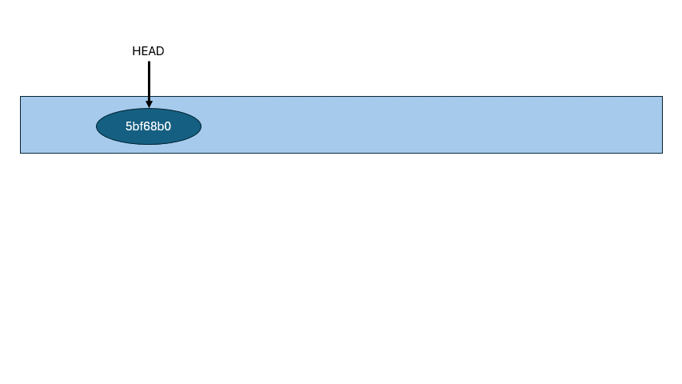

## Actividad: Explorando diferentes formas de fusionar en Git

### Objetivo de aprendizaje:  

En esta actividad, exploraremos el proceso de fusionar dos ramas en Git utilizando tres métodos diferentes: *fast-forward*, *no-fast-forward* y *squash*. A través de los ejemplos, comprenderás cómo funcionan y cuándo es recomendable utilizar cada tipo de fusión.

#### Contexto

En el mundo del desarrollo de software, Git se ha consolidado como una herramienta esencial para la gestión de versiones, permitiendo a equipos y desarrolladores individuales llevar un control preciso de los cambios en el código fuente.

Dentro de Git, las fusiones juegan un rol fundamental al combinar el trabajo de diferentes ramas, integrando características, correcciones y mejoras al código base. 

Sin embargo, no todas las fusiones son iguales, y las estrategias disponibles en Git ofrecen distintos beneficios según el contexto de desarrollo. Esta actividad explora tres estrategias de fusión: **Fast-forward**, **No-fast-forward**, y **Squash**, cada una adaptada a situaciones específicas, desde desarrollos individuales hasta metodologías ágiles, CI/CD y DevOps.

##### 1. Fast-forward: Mantener un historial limpio y lineal

[Fast-forward merges are the future #git #coding](https://www.youtube.com/shorts/j1HTNbvBt7E)


La fusión fast-forward en Git es la ==opción predeterminada y más simple cuando no se han realizado commits en la rama principal (o base) desde que se creó la rama de característica==. En lugar de crear un nuevo commit de fusión, este método simplemente mueve el puntero HEAD de la rama principal al último commit de la rama de característica. Como resultado, el historial de commits permanece lineal y sin interrupciones.

El fast-forward es ideal en desarrollos individuales o proyectos pequeños, donde el flujo de trabajo es secuencial y no se realizan múltiples contribuciones paralelas. ==Al evitar commits de fusión innecesarios, este enfoque mantiene el historial del proyecto limpio y fácil de seguir.== Para desarrolladores que trabajan solos, la fusión fast-forward es perfecta, ya que no agrega complejidad innecesaria ni desordena el historial.

Sin embargo, esta simplicidad puede convertirse en un obstáculo en proyectos colaborativos más grandes. ==Al no registrar explícitamente el punto de fusión entre ramas, la capacidad de entender el contexto de la integración de características se pierde==. A largo plazo, en un equipo, puede ser difícil rastrear cuándo y cómo se fusionaron diferentes ramas, lo que convierte al fast-forward en una estrategia menos adecuada para proyectos con múltiples colaboradores o donde los cambios ocurren simultáneamente en varias ramas.

##### 2. No-fast-forward: Preservar el contexto de los cambios

A diferencia de la fusión fast-forward, ==la opción no-fast-forward crea un commit de fusión que preserva explícitamente el momento y el contexto en el que se integraron las ramas==. Esta estrategia es fundamental en entornos de trabajo colaborativo, especialmente en proyectos grandes donde múltiples desarrolladores están trabajando simultáneamente en diferentes características o correcciones.

El commit de fusión que se genera en una fusión no-fast-forward tiene dos "parent commits": uno correspondiente a la rama de origen y otro a la rama destino. Este enfoque proporciona una clara trazabilidad de los cambios y facilita la revisión del historial, lo que es crucial en equipos donde es necesario entender no solo qué cambios se hicieron, sino también cuándo y por qué se unieron a la rama principal.

Para equipos grandes, la estrategia no-fast-forward es esencial, ya que permite la preservación de un registro claro de las fusiones. Es particularmente útil en proyectos donde la colaboración es constante y donde diferentes ramas de trabajo pueden tener una vida más larga. Este enfoque asegura que los desarrolladores puedan revisar el contexto de una fusión en cualquier momento, ofreciendo transparencia en el proceso de desarrollo.

No obstante, el uso excesivo de commits de fusión puede desordenar el historial, dificultando su lectura. Por lo tanto, es importante que los equipos balanceen el uso de no-fast-forward con la necesidad de mantener un historial manejable, reservándolo para fusiones clave que involucren integraciones importantes.

##### 3. Squash: Condensar cambios para una rama principal limpia

La opción squash ofrece una estrategia diferente, orientada a mantener la limpieza del historial al integrar ramas de características. Esta técnica toma todos los commits de la rama de origen y los aplasta en un solo commit antes de fusionarlos con la rama principal. El resultado es un historial limpio y condensado, ideal para proyectos donde se prioriza la simplicidad y claridad en el código base.

El uso de fusiones squash es común en metodologías ágiles, CI/CD y entornos DevOps, donde se busca integrar frecuentemente características en ciclos cortos de desarrollo. Los equipos que adoptan estas metodologías tienden a realizar pruebas, refactorizaciones y cambios iterativos dentro de sus ramas de trabajo. A través del squash, todos estos pequeños commits experimentales y de prueba se combinan en uno solo, eliminando ruido en el historial y haciendo que la rama principal se mantenga limpia y enfocada solo en los cambios finales e importantes.

Sin embargo, el uso de squash tiene una desventaja significativa: al aplastar los commits, se pierde el historial detallado de los cambios individuales realizados en la rama de característica. Esto puede ser un problema si se necesita entender el proceso de desarrollo de esa característica o si los commits individuales tienen valor informativo. Aunque simplifica el historial, el squash sacrifica la trazabilidad de los pasos intermedios.

Además, el squash puede generar dilemas éticos en equipos colaborativos, ya que el autor del commit consolidado puede ser diferente de quienes realizaron los commits originales. En proyectos donde es importante mantener la atribución de autoría o el contexto completo de los cambios, el squash debe usarse con prudencia. Es crucial encontrar un balance entre mantener la limpieza del historial y respetar la integridad de los commits individuales de los colaboradores.

Cada una de estas estrategias de fusión tiene su lugar dentro del flujo de trabajo de Git, dependiendo del contexto del proyecto y los objetivos del equipo. El fast-forward es ideal para mantener un historial limpio en proyectos individuales o sencillos, mientras que el no-fast-forward proporciona un valioso contexto en equipos grandes donde la transparencia en las fusiones es crucial. Finalmente, el squash es una herramienta poderosa para proyectos ágiles y de DevOps, donde la limpieza del historial es una prioridad, aunque conlleva ciertos riesgos en la preservación del historial detallado.

Elegir la estrategia de fusión adecuada es una decisión crítica para mantener un flujo de trabajo eficiente y un historial de Git claro y manejable, particularmente en equipos colaborativos. Comprender cuándo y cómo usar cada tipo de fusión permitirá a los desarrolladores optimizar sus prácticas de integración y asegurar que el desarrollo continúe de manera fluida y organizada.

---
### Ejemplos

#### 1. Fusión Fast-forward (git merge --ff)

La fusión fast-forward es la forma más simple de combinar ramas en Git. ==Solo es posible cuando la rama base no ha recibido nuevos commits desde que se creó la rama feature==.

##### Pasos prácticos:

```bash
# Crear un nuevo repositorio
$ mkdir prueba-fast-forward-merge
$ cd prueba-fast-forward-merge
$ git init

# Agregar un archivo inicial en la rama principal (main)
$ echo "# Mi Proyecto" > README.md
$ git add README.md
$ git commit -m "Commit inicial en main"

# Crear y cambiar a una nueva rama 'add-description'
$ git checkout -b add-description

# Hacer cambios en la nueva rama y comitearlos
$ echo "Este proyecto es un ejemplo de cómo usar Git." >> README.md
$ git add README.md
$ git commit -m "Agregar descripción al README.md"
```

**Pregunta:** Muestra la estructura de commits resultante.

> 


> **La rama por principal por defecto es `master`, la cambiaré a `main**

> 
> 

```bash
# Cambiar de vuelta a la rama 'main' y realizar la fusión fast-forward
$ git checkout main
$ git merge add-description
	
# Ver el historial lineal
$ git log --graph --oneline
```

> **Vemos que la fusión se realizó sin ningún conflicto**

> 

**Resultado:** El historial de tu repositorio.

#### 2. Fusión No-fast-forward (git merge --no-ff)

La fusión no-fast-forward crea un nuevo commit de fusión. Es útil para preservar el contexto de la fusión, especialmente en equipos donde se requiere más claridad en el historial de cambios.

##### Pasos prácticos:

```bash
# Crear un nuevo repositorio
$ mkdir prueba-no-fast-forward-merge
$ cd prueba-no-fast-forward-merge
$ git init

# Agregar un archivo inicial en la rama principal (main)
$ echo "# Mi Proyecto" > README.md
$ git add README.md
$ git commit -m "Commit inicial en main"

# Crear y cambiar a una nueva rama 'add-feature'
$ git checkout -b add-feature

# Hacer cambios en la nueva rama y comitearlos
$ echo "Implementando una nueva característica..." >> README.md
$ git add README.md
$ git commit -m "Implementar nueva característica"
```

**Pregunta:** Muestra el log de commits resultante.

> 

```bash
# Cambiar de vuelta a la rama 'main' y realizar una fusión no-fast-forward
$ git checkout main
$ git merge --no-ff add-feature
```

Después de la edición, veamos el log ahora:
```bash
# Ver el historial
$ git log --graph --oneline
```

> **Al no haber conflictos, se realizó el merge y automáticamente se realizo el commit de fusión con el mensaje por defecto "Merge branch 'add-feature' with no-fast-forward approach"

> 

El historial de tu repositorio mostrará un commit de fusión.

##### 3. Fusión squash (git merge --squash)

La fusión squash combina todos los cambios de una rama en un solo commit en la rama principal. Este método es útil cuando se quiere mantener un historial de commits limpio.

##### Pasos prácticos:

```bash
# Crear un nuevo repositorio
$ mkdir prueba-squash-merge
$ cd prueba-squash-merge
$ git init

# Agregar un archivo inicial en la rama principal (main)
$ echo "# Mi Proyecto" > README.md
$ git add README.md
$ git commit -m "Commit inicial en main"

# Crear y cambiar a una nueva rama 'add-basic-files'
$ git checkout -b add-basic-files

# Hacer algunos cambios y comitearlos
$ echo "# CÓMO CONTRIBUIR" >> CONTRIBUTING.md
$ git add CONTRIBUTING.md
$ git commit -m "Agregar CONTRIBUTING.md"

$ echo "# LICENCIA" >> LICENSE.txt
$ git add LICENSE.txt
$ git commit -m "Agregar LICENSE.txt"
```

**Pregunta:** ¿Cuál es tu estructura de commits?

> **Se presenta la estructura a continuación*

> 

```bash
# Cambiar de vuelta a la rama 'main' y realizar la fusión squash
$ git checkout main
$ git merge --squash add-basic-files
```


> 
> 

> **Al validar los commits y ver el status obtuve**:

> 

> **Lo que me indica que `git merge --squash` no hace el commit automáticamente**


Los commits luego se aplastan y se convierten en un solo commit:

Para completar la fusión squash, realiza un commit:
```bash
$ git add .
$ git commit -m "Agregar documentación estándar del repositorio"
$ git log --graph --oneline
```

> 

> **Esto combinará todos los cambios de la rama add-multiple-features en un solo nuevo commit en la rama main.**

---

#### Ejercicios

1. **Clona un repositorio Git con múltiples ramas.**  
   Identifica dos ramas que puedas fusionar utilizando `git merge --ff`.  
   Haz el proceso de fusión utilizando `git merge --ff`.  
   Verifica el historial con `git log --graph --oneline`.  

   **Pregunta:** ¿En qué situaciones recomendarías evitar el uso de `git merge --ff`? Reflexiona sobre las desventajas de este método.

2. **Simula un flujo de trabajo de equipo.**  
   Trabaja en dos ramas independientes, creando diferentes cambios en cada una.  
   Fusiona ambas ramas con `git merge --no-ff` para ver cómo se crean los commits de fusión.  
   Observa el historial utilizando `git log --graph --oneline`.  

   **Pregunta:** ¿Cuáles son las principales ventajas de utilizar `git merge --no-ff` en un proyecto en equipo? ¿Qué problemas podrían surgir al depender excesivamente de commits de fusión?

3. **Crea múltiples commits en una rama.**  
   Haz varios cambios y commits en una rama feature.  
   Fusiona la rama con `git merge --squash` para aplanar todos los commits en uno solo.  
   Verifica el historial de commits antes y después de la fusión para ver la diferencia.  

   **Pregunta:** ¿Cuándo es recomendable utilizar una fusión squash? ¿Qué ventajas ofrece para proyectos grandes en comparación con fusiones estándar?


#### Resolver conflictos en una fusión non-fast-forward

En algunos casos, las fusiones no son tan sencillas y pueden surgir conflictos que necesitas resolver manualmente. Este ejercicio te guiará a través del proceso de manejo de conflictos.

1. Inicializa un nuevo repositorio:
   ```bash
   mkdir prueba-merge-conflict
   cd prueba-merge-conflict
   git init
   ```

2. Crea un archivo index.html y realiza un commit en la rama main:
   ```bash
   echo "<html><body><h1>Proyecto inicial CC3S2</h1></body></html>" > index.html
   git add index.html
   git commit -m "commit inicial del  index.html en main"
   ```

---
```html
<!DOCTYPE html>
<html lang="en">
<head>
    <meta charset="UTF-8">
    <meta name="viewport" content="width=device-width, initial-scale=1.0">
    <title>Document</title>
</head>
<body>
    <h1>Initial Project CC3S2</h1>
</body>
</html>
```

> **Agrego el primer commit y muestro el historial**

> 

---


3. Crea y cambia a una nueva rama feature-update:
   ```bash
   git checkout -b feature-update
   ```
> 


4. Edita el archivo y realiza un commit en la rama feature-update:
   ```bash
   echo "<p>.....</p>" >> index.html
   git add index.html
   git commit -m "Actualiza ..."
   ```


> **Observamos los cambios**
---

**Este es mi archivo index.html**

```html
<!DOCTYPE html>
<html lang="en">
<head>
    <meta charset="UTF-8">
    <meta name="viewport" content="width=device-width, initial-scale=1.0">
    <title>Document</title>
</head>
<body>
    <h1>Initial Project CC3S2</h1>
    <p>When adding this paragraph I'm on the feature-update branch/p>
</body>
</html> 
```

**Segundo commit**

> 
---


5. Regresa a la rama main y realiza una edición en el mismo archivo:
   ```bash
   git checkout main
   echo "<footer>Contacta aquí example@example.com</footer>" >> index.html
   git add index.html
   git commit -m "....index.html"
   ```


> **Agregamos un footer en index.html**

---

```html
<!DOCTYPE html>
<html lang="en">
<head>
    <meta charset="UTF-8">
    <meta name="viewport" content="width=device-width, initial-scale=1.0">
    <title>Document</title>
</head>
<body>
    <h1>Initial Project CC3S2</h1>
    <footer>
        <a href="mailto:example@example.com">Contact Us</a>
    </footer>
</body>
</html>
```


> 


---


6. Fusiona la rama feature-update con --no-ff y observa el conflicto:
   ```bash
   git merge --no-ff feature-update
   ```

7. Git detectará un conflicto en index.html. Abre el archivo y resuelve el conflicto. Elimina las líneas de conflicto generadas por Git (`<<<<<<<`, `=======`, `>>>>>>>`) y crea la versión final del archivo con ambos cambios:

   ```html
   <html>
     <body>
       <h1>....</h1>
       <p>....</p>
       <footer>...example@example.com</footer>
     </body>
   </html>
   ```

---

> **Antes de resolver los conflictos**

```html
<!DOCTYPE html>
<html lang="en">
<head>
    <meta charset="UTF-8">
    <meta name="viewport" content="width=device-width, initial-scale=1.0">
    <title>Document</title>
</head>
<body>
    <h1>Initial Project CC3S2</h1>
<<<<<<< HEAD
    <footer>
        <a href="mailto:example@example.com">Contact Us</a>
    </footer>
=======
    <p>When adding this paragraph I'm on the feature-update branch/p>
>>>>>>> feature-update
</body>
</html> 
```

> **Después de arreglar el conflicto**

```html
<!DOCTYPE html>
<html lang="en">

<head>
    <meta charset="UTF-8">
    <meta name="viewport" content="width=device-width, initial-scale=1.0">
    <title>Document</title>
</head>

<body>
    <h1>Initial Project CC3S2</h1>
    <p>When adding this paragraph I'm on the feature-update branch/p>
    <footer>
        <a href="mailto:example@example.com">Contact Us</a>
    </footer>
</body>

</html>
```

---

8. Agrega el archivo corregido y completa la fusión:

   ```bash
   git add index.html
   git commit
   ```

> 


9. Verifica el historial para confirmar la fusión y el commit de resolución de conflicto:

   ```bash
   git log --graph --oneline
   ```

> 

> **El *commit* que resolvió los conflictos de merge tiene dos padres `5cb56dc` y `8cdd777`**

> 


**Preguntas:**
- ¿Qué pasos adicionales tuviste que tomar para resolver el conflicto?

> No tuve que realizar ningún paso adicional mas allá de ejecutar el comando `git log --graph --oneline --all` después de cada cambio ya sea de rama o al realizar un nuevo *commit* para tener una mejor perspectiva de los cambios.


- ¿Qué estrategias podrías emplear para evitar conflictos en futuros desarrollos colaborativos?

> El conflicto surgió porque dos ramas trabajaron en el mismo archivo, una estrategia sería que cada rama creada trabaje en un archivo o módulo independiente. Considero importante usar los enfoques de **código de propósito único** y **código completo**.


> **A continuación una demostración visual del flujo de trabajo de estos ejercicios**




#### Ejercicio: Comparar los historiales con git log después de diferentes fusiones

Este ejercicio te permitirá observar las diferencias en el historial generado por fusiones fast-forward, non-fast-forward y squash.

##### Pasos

1. Crea un nuevo repositorio y realiza varios commits en dos ramas:
   ```bash
   mkdir prueba-compare-merge
   cd prueba-compare-merge
   git init
   echo "Version 1.0" > version.txt
   git add version.txt
   git commit -m "...."
   git checkout -b feature-1
   echo "Caracteristica 1 agregada" >> version.txt
   git add version.txt
   git commit -m "Agregar caracteristica 1"
   git checkout main
   git checkout -b feature-2
   echo "Caracteristica 2 agregada" >> version.txt
   git add version.txt
   git commit -m "Se agrega caracteristica 2"
   ```


> **Commits e historial por cada vez que se añade un commit**.
> Justificación: Podemos ver como se va modificando el historial por cada commit creado. Al inicio vemos que el historial es lineal y se va ramificando al crear ramas y hacer fusiones.


> 
> 
> 
> 


2. Fusiona feature-1 usando fast-forward:
   ```bash
   git checkout main
   git merge feature-1 --ff
   ```


> 


4. Fusiona feature-2 usando non-fast-forward:
   ```bash
   git merge feature-2 --no-ff
   ```


> **Al realizar un merge `--no-ff` tenemos 


> 


> **Resolvemos los conflictos**

> 
>  

> **Una vez resuelto los conflictos, realizamos el commit de fusión (manualmente)**

> 


6. Realiza una nueva rama feature-3 con múltiples commits y fusiónala con squash:
   ```bash
   git checkout -b feature-3
   echo "Caracteristica 3 paso 1" >> version.txt
   git add version.txt
   git commit -m "Caracteristica 3 paso 1"
   ```

> **Creamos la rama `feature-3` y agregamos el commit**

> 


```bash
   echo "Caracteristica 3 paso 2" >> version.txt
   git add version.txt
   git commit -m "Caracteristica 3 paso 2"
```
> 


```shell
   git checkout main
   git merge --squash feature-3
   git commit -m "Agregar caracteristica 3 en un commit"
```

> **Procedemos a realizar el git squash con la rama `feature-3`, esto agrega los commits de esta rama en `main`, "aplastando" los commits de `feature-3` en un solo commit que se agregará a main.

> 


4. Compara el historial de Git:
   
   - Historial Fast-forward:
     ```bash
     git log --graph --oneline --merges --first-parent –branches
     ```
> 


   - Historial Non-fast-forward:
     ```bash
     git log --graph --oneline –merges
     ```
> 

   - Historial con Squash:
     ```bash
     git log --graph --oneline --merges --decorate --all
     ```
> 


**Preguntas:**
- ¿Cómo se ve el historial en cada tipo de fusión?
**Respuesta**

> **Fusión --ff**: El HEAD apunta tanto a `main` como a `feature1` , el flujo es lineal ya que no hubo commits posteriores en main luego de crear la rama `feature1`.
> **Fusion --non-ff**: El HEAD apunta solo a `main` esto es porque se han agregado los cambios de `feature2` en `main`, se resolvieron conflictos y el flujo de trabajo total presenta una bifurcación.
> **Fusion squash**: El HEAD también apunta a `main`  sin embargo solo se observa el commit 
merge squash.

- ¿Qué método prefieres en diferentes escenarios y por qué?

**Respuesta**:

> - Si estoy trabajando en un proyecto en solitario usaría *fast-forward*. Ya que lo considero más sencillo y no tendría conflictos pues la única persona encargada del desarrollo sería yo misma. El único cuidado en el que tendría sería simplemente trabajar en una rama a la vez.
> 
> - Si estoy trabajando en equipo *non-fast-forward* me parece el más adecuado porque si o si habrá conflictos al hacer merge y es mejor resolverlos manualmente. 
> - Considero que *merge --squash* es útil cuando estoy resolviendo un bug, ya que generalmente no lo resuelvo en el primer commit. Expondré un ejemplo:
> 	1. Encuentro un bug en la rama `develop`
> 	2. Creo una rama `bugfix` para resolver el bug
> 	3. Resolví el bug, hago un commit y hago un push a la repo remota, esto activara GitHub Actions, veo que en realidad no he resuelvo el bug.
> 	4. Ahora sí resolví el bug, hago todo el proceso del punto 3: veo que en realidad no he resuelto el bug.
> 	5. Esta vez no tuve ningún error, Github Actions ejecuto satisfactoriamente cada job, entonces ahora puedo hacer un `git merge --squash` con la rama `develop` con un único commit, para no ensuciar el historial con mis commits fallidos.


#### Ejercicio: Usando fusiones automáticas y revertir fusiones

En este ejercicio, aprenderás cómo Git puede fusionar automáticamente cambios cuando no hay conflictos y cómo revertir una fusión si cometes un error.

##### Pasos

1. Inicializa un nuevo repositorio y realiza dos commits en main:
   ```bash
   mkdir prueba-auto-merge
   cd prueba-auto-merge
   git init
   echo "Linea 1" > file.txt
   git add file.txt
   git commit -m "Agrega linea 1"
   echo "Linea 2" >> file.txt
   git add file.txt
   git commit -m "...linea 2"
   ```

> **Vemos el historial una vez hecho los primeros commits del ejercicio**

> 

2. Crea una nueva rama auto-merge y realiza otro commit en file.txt:
   ```bash
   git checkout -b auto-merge
   echo "Linea 3" >> file.txt
   git add file.txt
   git commit -m "... linea 3"
   ```

> **Ahora hemos agregado un nuevo commit, esta vez en la rama `auto-merge`

> 


3. Vuelve a main y realiza cambios no conflictivos en otra parte del archivo:
   ```bash
   git checkout main
   ```

> **Este es el historial cuando me posiciono nuevamente en la rama `main`

> 

```sh
   echo "Footer: Fin del archivo" >> file.txt
   git add file.txt
   git commit -m "Add footer al archivo file.txt"
```

> **Al agregar un nuevo cambio en la rama `main` vemos como se modifica el historial. Ya no es lineal, ahora existe una bifurcación ya hemos agregado un commit en `main`.

> 

4. Fusiona la rama auto-merge con main:
   ```bash
   git merge auto-merge
   ```


> **Una vez que ejecute el comando `git merge auto-merge`: Si hubo conflictos, ya que en la tercera línea para la rama `auto-merge` es "Linea 3", mientras que para la rama `main` es "Footer: fin del archivo". Resolví conflictos y luego aplique un commit.

> 

5. Git debería fusionar los cambios automáticamente sin conflictos.

> **No lo hace, si hubo conflictos, como se explicó en el punto 4.**

6. Revertir la fusión: Si decides que la fusión fue un error, puedes revertirla:
   ```bash
   git revert -m 1 HEAD
   ```


7. Verifica el historial:
   ```bash
   git log --graph --oneline
   ```

> **Vemos que en efecto se realizo el revert en el commit `9c350c0`

> 


**Preguntas:**
- ¿Cuándo usarías un comando como git revert para deshacer una fusión?

**Respuesta**

> Por ejemplo, si la rama secundaria era para agregar una funcionalidad (`feature`) o resolver un bug y por alguna razón hice merge antes de cumplir el objetivo, usar git revert podría ser una opción.

- ¿Qué tan útil es la función de fusión automática en Git?

**Respuesta**

> Yo lo considero util en cuanto la rama principal (desde donde se ha creado la rama secundaria donde vamos a generar los cambios) se mantenga sin modificaciones, en otros casos considero que las fusiones tipo `--no-ff`, `merge --squash` o incluso rebase son mejores opciones.

#### Ejercicio: Fusión remota en un repositorio colaborativo

Este ejercicio te permitirá practicar la fusión de ramas en un entorno remoto colaborativo, simulando un flujo de trabajo de equipo.

##### Pasos:

1. Clona un repositorio remoto desde GitHub o crea uno nuevo:
   ```bash
   git clone https://github.com/tu-usuario/nombre-del-repositorio.git
   cd nombre-del-repositorio
   ```

2. Crea una nueva rama colaboracion y haz algunos cambios:
   ```bash
   git checkout -b colaboracion
   echo "Colaboración remota" > colaboracion.txt
   git add colaboracion.txt
   git commit -m "...."
   ```

3. Empuja los cambios a la rama remota:
   ```bash
   git push origin colaboracion
   ```

4. Simula una fusión desde la rama colaboracion en la rama main de otro colaborador. (Puedes usar la interfaz de GitHub para crear un Pull Request y realizar la fusión).

**Preguntas:**
- ¿Cómo cambia la estrategia de fusión cuando colaboras con otras personas en un repositorio remoto?
- ¿Qué problemas comunes pueden surgir al integrar ramas remotas?


#### Ejercicio final: flujo de trabajo completo

Configura un proyecto simulado:

- Crea un proyecto con tres ramas: main, feature1, y feature2.
- Realiza varios cambios en feature1 y feature2 y simula colaboraciones paralelas.
- Realiza fusiones utilizando diferentes métodos:
  - Fusiona feature1 con main utilizando `git merge --ff`.
  - Fusiona feature2 con main utilizando `git merge --no-ff`.
  - Haz una rama adicional llamada feature3 y aplasta sus commits utilizando `git merge --squash`.

Analiza el historial de commits:

- Revisa el historial para entender cómo los diferentes métodos de fusión afectan el árbol de commits.
- Compara los resultados y discute con tus compañeros de equipo cuál sería la mejor estrategia de fusión para proyectos más grandes.

