## **Actividad: Rebase, Cherry-Pick y CI/CD en un entorno ágil**

### Objetivo de aprendizaje:  

Aprender a usar los comandos `git rebase` y `git cherry-pick` para mantener un historial de commits limpio y manejable en proyectos colaborativos.  También explorarás cuándo y por qué utilizar estos comandos en lugar de los merges regulares.

#### **Parte 1: git rebase para mantener un historial lineal**

1. **Introducción a Rebase:**

   El rebase mueve tus commits a una nueva base, dándote un historial lineal y limpio. En lugar de fusionar ramas y mostrar un "commit de merge", el rebase integra los cambios aplicándolos en la parte superior de otra rama.

   - **Caso de uso**: Simplifica la depuración y facilita la comprensión del historial de commits.

2. **Escenario de ejemplo:**

   - Crea un nuevo repositorio Git y dos ramas, main y new-feature:
   
```bash
$ mkdir prueba-git-rebase
$ cd prueba-git-rebase
$ git init
$ echo "# Mi Proyecto de Rebase" > README.md
$ git add README.md
$ git commit -m "Commit inicial en main"
```

---

> 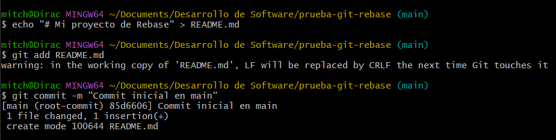

> 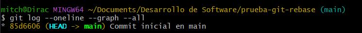

**Se realizó el primer commit**

---


   - Crea y cambia a la rama new-feature:
     ```bash
     $ git checkout -b new-feature
     $ echo "Esta es una nueva característica." > NewFeature.md
     $ git add NewFeature.md
     $ git commit -m "Agregar nueva característica"
     ```

**Pregunta:** Presenta el historial de ramas obtenida hasta el momento.

---

> 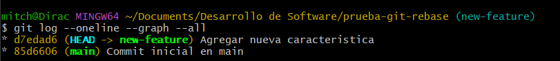

**Vemos que hasta el momento tenemos 2 commits. El historial de la  rama feature presenta los commits `d7edad6` y `85d6606`, puesto que surgió del primer commit. La rama main sigue apuntando al primer commit `856606`

**Consideré agregar dos commits más a la rama `new-feature` para que el ejercicio se entienda mejor**

> 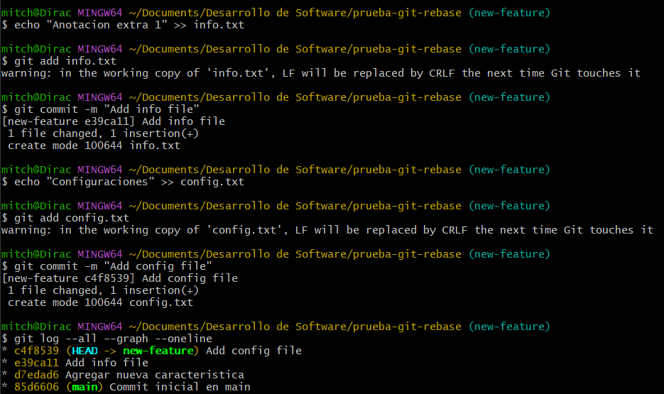


   Ahora, digamos que se han agregado nuevos commits a main mientras trabajabas en new-feature:

   ```bash
   # Cambiar de nuevo a 'main' y agregar nuevos commits
   $ git checkout main
   $ echo "Updates to the project." >> Updates.md
   $ git add Updates.md
   $ git commit -m "Update main"
   ```

---

**Proceso a agregar un commit en la rama main**

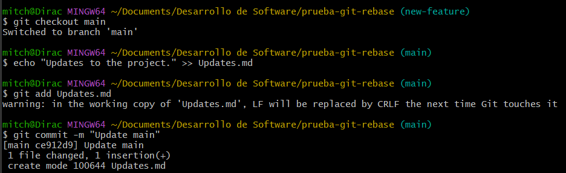

   Tu gráfico de commits ahora diverge (comprueba esto)

---

> 
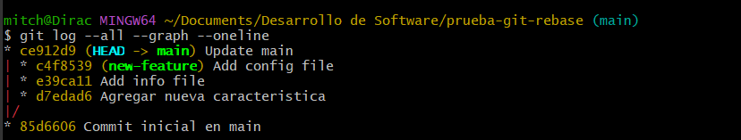

**Interpretación**: A partir del commit inicial se creo una nueva rama `new-feature`, en esta se ha ido trabajando, los commits que se agregaron estando en esta rama son `d7edad6`, `e39ca11` y `c4f8539`. Luego cambiamos de rama y estando en `main` hemos agregado un nuevo commit: `ce912d9`. Esto hace que se muestre una bifurcación, puesto que `ce912d9` y `d7edad6` comparten el mismo padre `85d6606` pero se trabajaron en distintas ramas.

---

   > **Tarea**: Realiza el rebase de `new-feature` sobre `main` con los siguientes comandos:

```bash
$ git checkout new-feature
$ git rebase main
```

---
**Realizamos el rebase

> 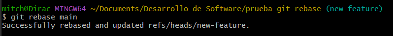

---


3. **Revisión:**

   Después de realizar el rebase, visualiza el historial de commits con:
   ```bash
   $ git log --graph –oneline
   ```

---

**Gracias al rebase nuestro historial vuelve a ser lineal**

> 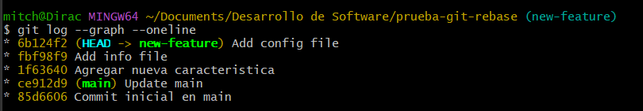

---

4. **Momento de fusionar y completar el proceso de git rebase:**
   ```bash
   # Cambiar a 'main' y realizar una fusión fast-forward
   $ git checkout main
   $ git merge new-feature
   ```

---

**Cuando vuelvo a `main` observo esto:**

> 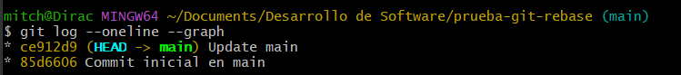

**Luego al hacer `git merge new-feature`**

> 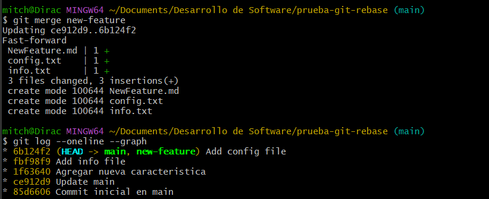


---

**A continuación presento un resumen visual de como se fue transformando el historial de commits a lo largo de este ejercicio al usar `git rebase`**


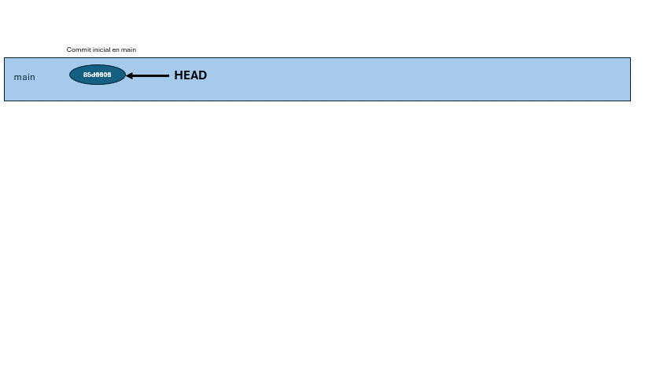


#### Parte 2: **git cherry-pick para la integración selectiva de commit**

1. **Introducción a Cherry-pick:**

   `git cherry-pick` te permite seleccionar commits individuales de una rama y aplicarlos en otra. Esto es útil cuando necesitas integrar una característica o corrección sin hacer merge de toda la rama.

   Imagina que tienes dos ramas, main y feature. Te das cuenta de que uno o dos commits de la rama feature deberían moverse a main, pero no estás listo para fusionar toda la rama. El comando `git cherry-pick` te permite hacer precisamente eso.

   Puedes hacer cherry-pick de los cambios de un commit específico en la rama feature y aplicarlos en la rama main.
   Esta acción creará un nuevo commit en la rama main.


3. **Escenario de ejemplo:**

   ```bash
   # Inicializar un nuevo repositorio
   $ mkdir prueba-cherry-pick
   $ cd prueba-cherry-pick
   $ git init

   # Agregar y commitear README.md inicial a main
   $ echo "# Mi Projecto" > README.md
   $ git add README.md
   $ git commit -m "Commit inicial"
```

---

**Realizamos el primer commit**

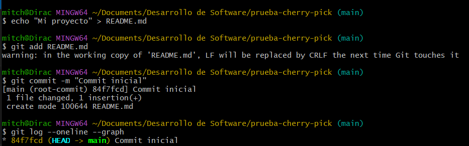

---

```bash
   # Crear y cambiar a una nueva rama 'add-base-documents'
   $ git checkout -b add-base-documents

   # Hacer cambios y commitearlos
   # Agregar CONTRIBUTING.md
   $ echo "# CONTRIBUTING" >> CONTRIBUTING.md
   $ git add CONTRIBUTING.md
   $ git commit -m "Se agrega CONTRIBUTING.md"

   # Agregar LICENSE.txt
   $ echo "LICENSE" >> LICENSE.txt
   $ git add LICENSE.txt
   $ git commit -m "Agrega LICENSE.txt"

   # Echa un vistazo al log de la rama 'add-base-documents'
   $ git log add-base-documents --graph --oneline
   ```

---

**Creamos la rama `add-base-documents` y agregamos dos commits en ella**

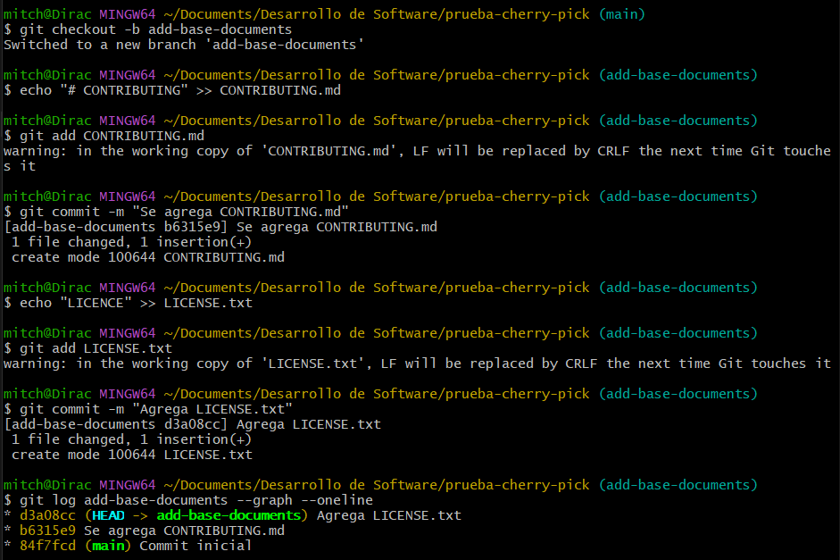


**Pregunta:** Muestra un diagrama de como se ven las ramas en este paso.

**Diagrama**

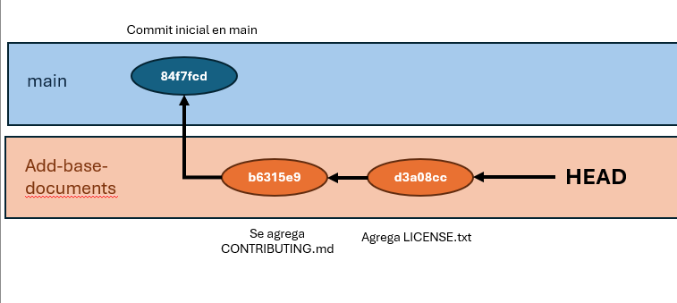


4. **Tarea: Haz cherry-pick de un commit de add-base-documents a main:**

   ```bash
   $ git checkout main
   $ git cherry-pick a80e8ad  # Reemplaza con el hash real del commit de tu log
   ```

---

**En mi caso elegí el commit `b6315e9`**

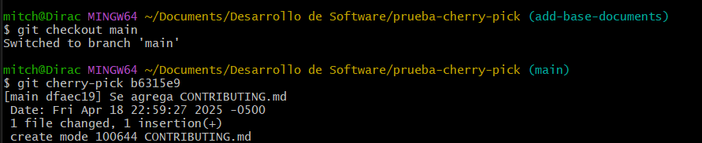

---


5. **Revisión:**  
   Revisa el historial nuevamente:
   ```bash
   $ git log --graph --oneline
   ```

---

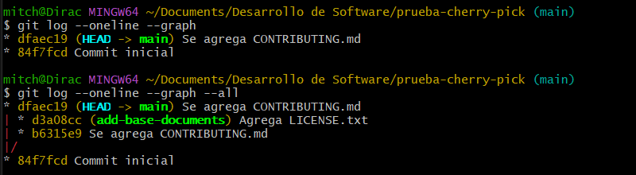

**Se observa que el commit hecho en la rama `add-base-documents`: `b63159` se ha agregado a la rama main con el commit `dfaec19`.

---


Después de que hayas realizado con éxito el cherry-pick del commit, se agregará un nuevo commit a tu rama actual (main en este ejemplo) y contendrá los cambios del commit cherry-picked.  

   Ten en cuenta que el nuevo commit tiene los mismos cambios pero un valor de hash de commit diferente. !Comprueba esto!.


---

**En efecto, el commit `b6315e9` que se creo estando en la rama `add-base-documents` se copio a la rama main en un nuevo commit `dfaec19`. Es fácil de comprobarlo ya que ambos tienen el mismo mensaje de commit. A continuación presento un resumen visual**

> 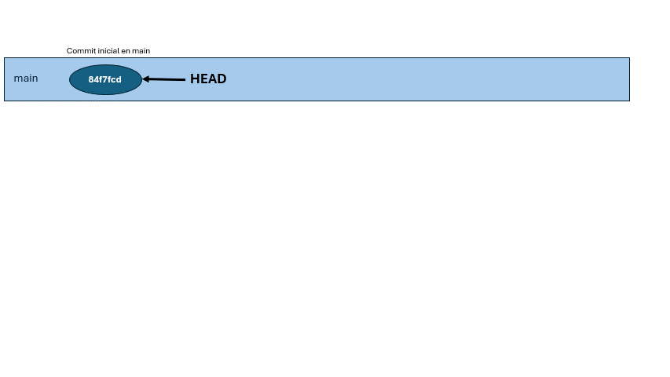


##### **Preguntas de discusión:**

1. ¿Por qué se considera que rebase es más útil para mantener un historial de proyecto lineal en comparación con merge?  

	**Respuesta**

> 	Porque lo que hace es crear nuevos commits con la misma información de la rama secundaria hacia la rama base. Por ejemplo, si tengo dos ramas, digamos `rama main`  y `rama feature`  y quiero agregar los cambios de la rama `feature` a la rama `main` lo que se hace con merge es crear un commit que fusione los cambios (si hay conflictos). En cambio, con `rebase` lo que se hace es que a partir de la rama `main` se agreguen todos los commit que se hicieron en la rama `feature` como si en un principio se hubieran commiteado en la misma rama `main`. Esto hace que el historial en la rama `main` permanezca lineal.

2. ¿Qué problemas potenciales podrían surgir si haces rebase en una rama compartida con otros miembros del equipo?  

	**Respuesta**

> 	El problema que he observado es que suprime commits anteriores al hacer rebase, es decir, si estoy en la rama `feature` y hago `git rebase main` se reescriben los commits de `feature` en main con un nuevo hash pero estos commits originales se pierden en el historial. Los nuevos `commits` son los que pertenecerán en los logs tanto para la rama `main` como la rama `feature`. 


3. ¿En qué se diferencia cherry-pick de merge, y en qué situaciones preferirías uno sobre el otro? 

	**Respuesta**

> 	Con `cherry-pick` puedo agregar commits específicos de una rama a otra. En cambio con merge, se agrega todos cambios realizados por los commits creados en una rama. Preferiría `cherry-pick` cuando no sea necesario extraer todos los cambios hechos en una rama sino un commit en particular.


4. ¿Por qué es importante evitar hacer rebase en ramas públicas?

	**Respuesta**

> 	Porque rebase reescribe el historial. Como lo mencione anteriormente `git rebase` extra cada uno de los commits de una rama y los agrega a otra, una por una. Es decir, se crea cada copia de un rama para agregarla a otra, pero ahí esta la clave, es "una copia", estas "copias" son las que ahora formaran parte del historial de la rama desde donde se realizaron originalmente los cambios y la rama donde se agregaran estos cambios. Sin embargo, los commits "originales" se perderán, ya no aparecerán en el historial, por lo que si estos commits pertenecían a un determinado autor, se perdería su autoría.


#### **Ejercicios teóricos**

1. **Diferencias entre git merge y git rebase**  
   **Pregunta**: Explica la diferencia entre git merge y git rebase y describe en qué escenarios sería más adecuado utilizar cada uno en un equipo de desarrollo ágil que sigue las prácticas de Scrum.

	**Respuesta**

>	Me enfocare en el caso general de git merge, el cual es `git merge --no-ff`. En este caso se crea un commit de fusión en donde se están agregando los cambios, digamos de una rama secundaria, a una una rama principal. Este commit de fusión es unitario, el commit tiene todos los cambios necesarios que se tienen que agregar a la rama principal, si hay conflictos se resuelven manualmente. Ahora, con `git rebase`, no hay un commit de fusión explicito, lo que se hace es crear copias de cada commit de la rama secundaria y se agregan a la rama principal. Entonces hay una clara diferencia entre como queda al final el historial de commits en ambos enfoques, en `git merge` tenemos ramas paralelas, que "unen" en un punto por un commit de fusión. en cambio, en `git rebase` el historial es lineal, tanto la rama principal como la rama secundaria presentan un historial lineal.

2. **Relación entre git rebase y DevOps**  
   **Pregunta**: ¿Cómo crees que el uso de git rebase ayuda a mejorar las prácticas de DevOps, especialmente en la implementación continua (CI/CD)? Discute los beneficios de mantener un historial lineal en el contexto de una entrega continua de código y la automatización de pipelines.

	**Respuesta**
>	La respuesta directa es el historial lineal, lo que hace que el análisis de errores sea más sencillo. El desarrollador no tiene que pelearse con una maraña de ramas que se bifurcan, están paralelas y luego se fusionan y así sucesivamente. Un historial lineal es claro y manejable.


4. **Impacto del git cherry-pick en un equipo Scrum**  
   **Pregunta**: Un equipo Scrum ha finalizado un sprint, pero durante la integración final a la rama principal (main) descubren que solo algunos commits específicos de la rama de una funcionalidad deben aplicarse a producción. ¿Cómo podría ayudar git cherry-pick en este caso? Explica los beneficios y posibles complicaciones.
> En este caso `git cherry pick` sería la mejor opción dado que permite agregar commits específicos de una rama hacia otra. Esto es de mucha ayuda para reducir los conflictos que surgirían si se realiza un `git merge` usual. Las posibles complicaciones puede ser un historial confuso, por lo tanto, tener una buena documentación es crucial para entender el flujo del código.

#### **Ejercicios prácticos**

1. **Simulación de un flujo de trabajo Scrum con git rebase y git merge**

   **Contexto:**  
   Tienes una rama `main` y una rama `feature` en la que trabajas. Durante el desarrollo del sprint, se han realizado commits tanto en `main` como en `feature`.  

   Tu objetivo es integrar los cambios de la rama `feature` en `main` manteniendo un historial limpio.

   **Instrucciones:**

   - Crea un repositorio y haz algunos commits en la rama main.
   - Crea una rama feature, agrega nuevos commits, y luego realiza algunos commits adicionales en main.
   - Realiza un rebase de feature sobre main.
   - Finalmente, realiza una fusión fast-forward de feature con main.

   **Preguntas:**

   - ¿Qué sucede con el historial de commits después del rebase?  

---

**Antes del rebase, el historial de commits era el siguiente:**


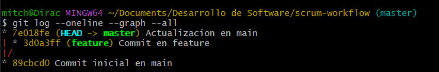

**Diagrama representativo**

> 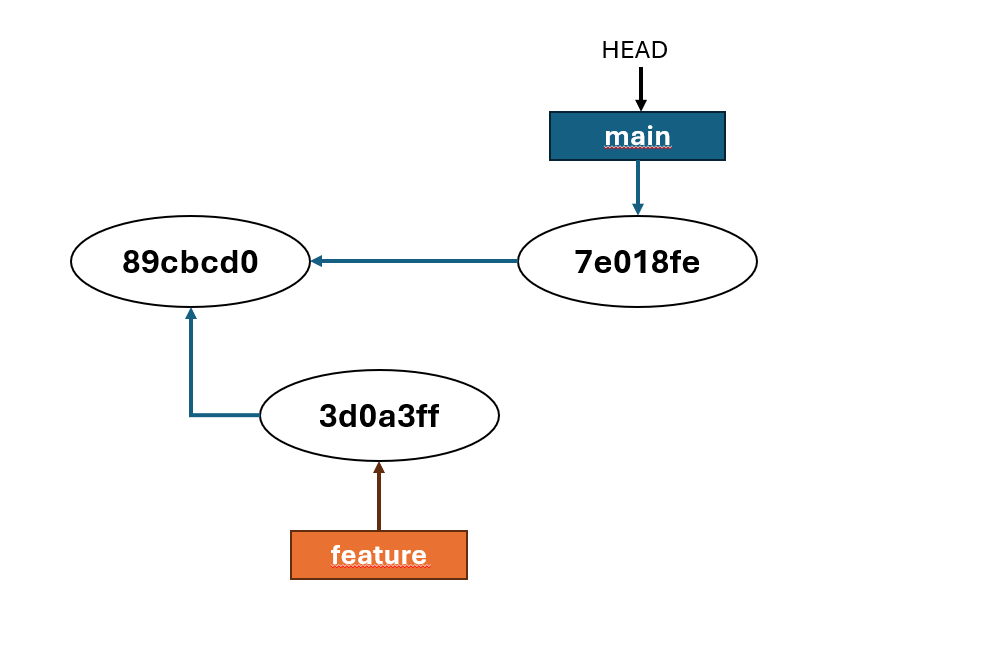


**Después de hacer `git checkout feature` y hacer `git rebase master`, el historial de commits cambio a:

> 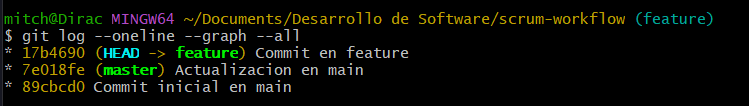

**Los cambios que observamos fueron:**
- Se perdió el commit `3d0a3ff` que daba inicio a la rama `feature`. 
- Se creo que commit `17b4690` con la misma información que el commit `3d0a3ff`.

**Diagrama**:

>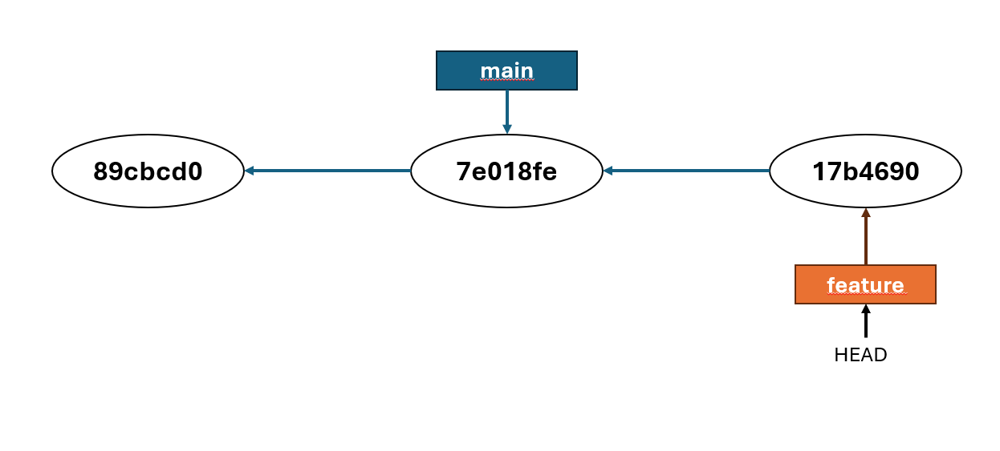


**Después, al hacer `git checkout main` y `git merge feature` el historial de commits será lineal, tanto para `main`, como para `feature`. Ambos tendrán la misma historial lineal de commit**s.
   
   - ¿En qué situación aplicarías una fusión fast-forward en un proyecto ágil?
	**Respuesta**
> 	Cuando no quiero reescribir el historial de commits, cuando quiero resolver los conflictos manualmente si se que surgirán fusiones o cuando me encuentro trabajando en un proyecto personal donde el único desarrollador soy yo.

---


**Mi rama principal local se llama `master`**

   ```bash
   $ mkdir scrum-workflow
   $ cd scrum-workflow
   $ git init
   $ echo "Commit inicial en main" > mainfile.md
   $ git add mainfile.md
   $ git commit -m "Commit inicial en main"
```


---

**Agregamos el primer commit**

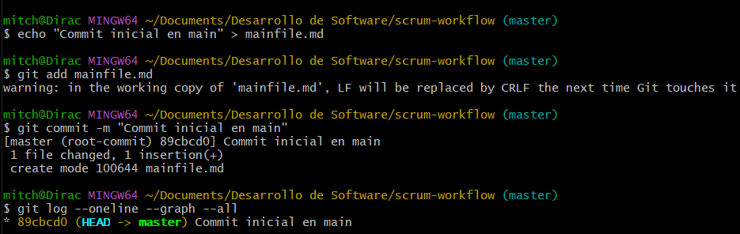

---


```bash
   $ git checkout -b feature
   $ echo "Nueva característica en feature" > featurefile.md
   $ git add featurefile.md
   $ git commit -m "Commit en feature"
```

---
**Nos movemos a la rama `feature` y agregamos un commit**

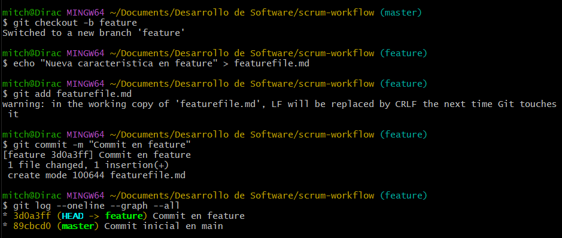

---


```bash
   $ git checkout main
   $ echo "Actualización en main" >> mainfile.md
   $ git add mainfile.md
   $ git commit -m "Actualización en main"
```

---

**Nos movemos nuevamente a la rama `main` y agregamos un commit**

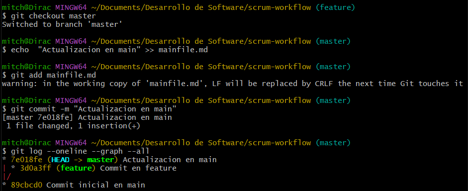

**Con este cambio nuevo historial ha quedado bifurcado**

---

```bash
   $ git checkout feature
   $ git rebase main
```

---

**Realizamos un rebase**

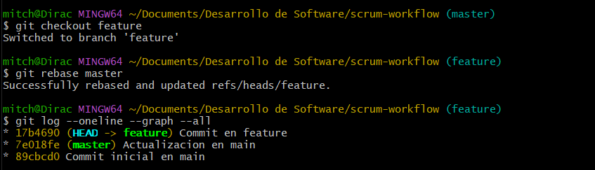

**Nuestro historial vuelve a ser lineal**

---

```bash
   $ git checkout main
   $ git merge feature --ff-only
   ```

---

**Una vez hecho el rebase hacemos el commit correspondiente**

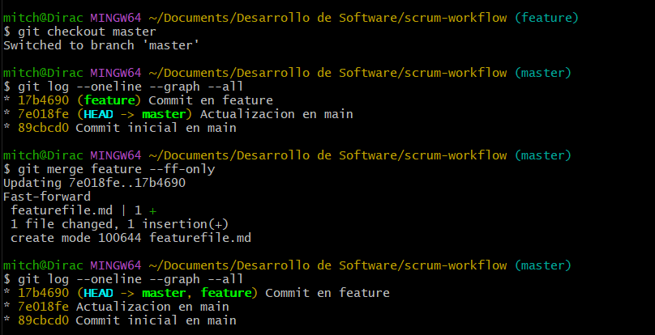

---


2. **Cherry-pick para integración selectiva en un pipeline CI/CD**

   **Contexto:**  
   Durante el desarrollo de una funcionalidad, te das cuenta de que solo ciertos cambios deben ser integrados en la rama de producción, ya que el resto aún está en desarrollo. Para evitar fusionar toda la rama, decides hacer cherry-pick de los commits que ya están listos para producción.

   **Instrucciones:**

   - Crea un repositorio con una rama main y una rama feature.
   - Haz varios commits en la rama feature, pero solo selecciona uno o dos commits específicos que consideres listos para producción.
   - Realiza un cherry-pick de esos commits desde feature a main.
   - Verifica que los commits cherry-picked aparezcan en main.

   **Preguntas:**

   - ¿Cómo utilizarías cherry-pick en un pipeline de CI/CD para mover solo ciertos cambios listos a producción? 
   
	**Respuesta**
	
> 	Para mover solo ciertos cambios listos a producción mediante `cherry-pick`, primero revisaría el historial de la rama de desarrollo (`git log`) para identificar los commits que contienen cambios estables y validados. Una vez identificados, ejecutaría `git cherry-pick <hash_commit>` desde la rama de producción o staging, lo que me permite integrar únicamente esos cambios sin arrastrar el resto del trabajo aún en desarrollo.

   - ¿Qué ventajas ofrece cherry-pick en un flujo de trabajo de DevOps?

		**Respuesta**
		
   > 	1. Nos ayuda a elegir exactamente los commits que contienen los cambios que deseamos integrar en una rama. Lo cual es útil si por ejemplo en la rama secundaría donde vamos a extraer los cambios se encuentra aun en desarrollo y no ha pasado todas las pruebas, pero ese commit o commits en particular están listos para agregarlo a una rama principal que se encarga de la producción.
   > 	2. Evitamos merge completo de ramas, con esto evitamos conflictos y errores en producción.
   > 	3. Si por ejemplo se tiene que liberar una funcionalidad de una rama feature, aunque la rama feature no este lista, si hay ciertos cambios listos para producción `cherry-pick` sería nuestra opción.

   **Comandos:**

   ```bash
   $ mkdir ci-cd-workflow
   $ cd ci-cd-workflow
   $ git init
   $ echo "Commit inicial en main" > main.md
   $ git add main.md
   $ git commit -m "Commit inicial en main"
```

---

**Realizamos el commit inicial**

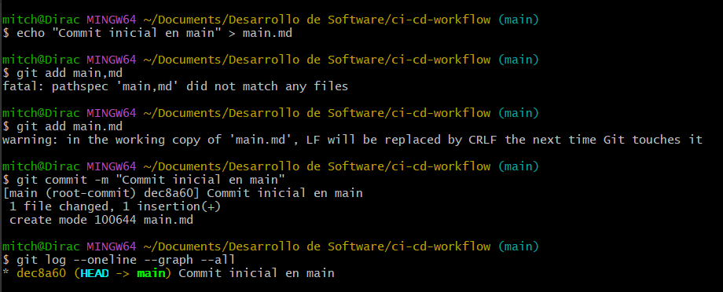

---

```bash
   $ git checkout -b feature
   $ echo "Primera característica" > feature1.md
   $ git add feature1.md
   $ git commit -m "Agregar primera característica"

   $ echo "Segunda característica" > feature2.md
   $ git add feature2.md
   $ git commit -m "Agregar segunda característica"
```

---

**Nos movemos a la rama `feature` y agregamos dos commits**

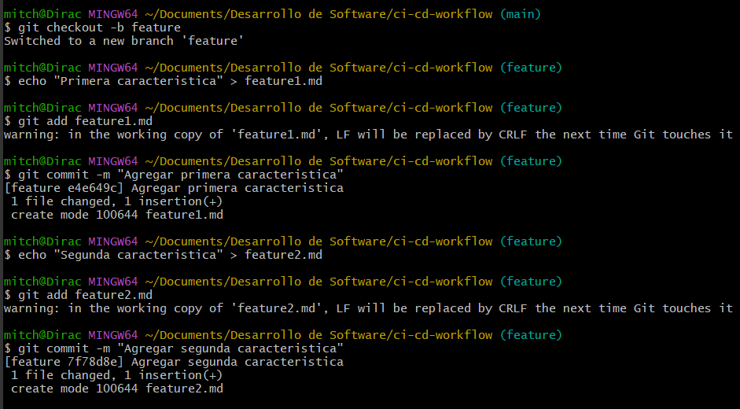

**Revisamos el historial**

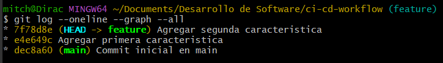

**He agregado 2 commits adicionales a lo que me indica el ejercicio para un mejor entendimiento del mismo**


> 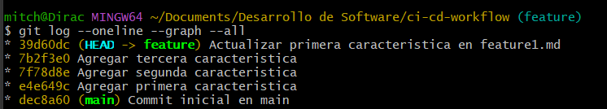

- **Agregué el commit `7b2f3e0` donde se añade un nuevo archivo `feature3.md` y el commit `39d60dc` donde se actualiza el archivo `feature1.md`. 
- **Ahora, los commits que agregaré a la rama `main` serán el primer y cuarto commit: `e4e649c`, `39d60dc`.**

---


```bash
   $ git checkout main
```

---

**Volvemos a `main` y validamos el historial en esta rama**

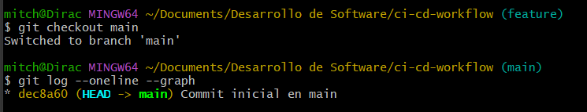

---


```bash
   $ git cherry-pick <hash_del_commit1>
   $ git cherry-pick <hash_del_commit2>
   ```

---

**Procedemos a realizar el `git cherry-pick`**

- **El commit elegido fue `e4e649c`, este cuenta con el mensaje: "Agregar primera característica"
- **Este commit se replica en la rama `main`. El commit que lo replica es `d20aa00`

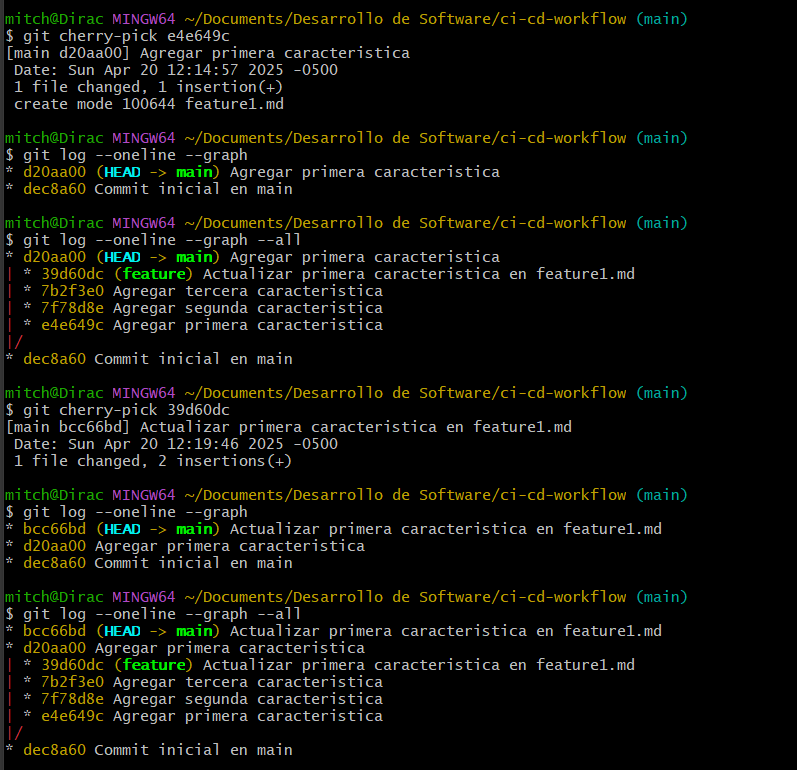


---

#### **Git, Scrum y Sprints**

#### **Fase 1: Planificación del sprint (sprint planning)**

**Ejercicio 1: Crear ramas de funcionalidades (feature branches)**

En esta fase del sprint, los equipos Scrum deciden qué historias de usuario van a trabajar. Cada historia de usuario puede representarse como una rama de funcionalidad.

**Objetivo:** Crear ramas para cada historia de usuario y asegurar que el trabajo se mantenga aislado.

**Instrucciones:**

1. Crea un repositorio en Git.
2. Crea una rama `main` donde estará el código base.
3. Crea una rama por cada historia de usuario asignada al sprint, partiendo de la rama `main`.

**Comandos:**
```bash
$ mkdir scrum-project
$ cd scrum-project
$ git init
$ echo "# Proyecto Scrum" > README.md
$ git add README.md
$ git commit -m "Commit inicial en main"
```

---

**Agregamos el primero commit**

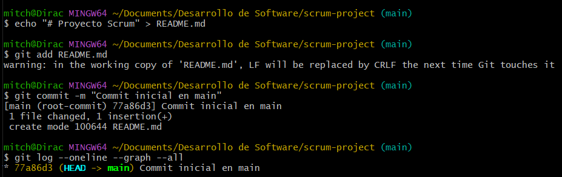

---

```bash
# Crear ramas de historias de usuario
$ git checkout -b feature-user-story-1
$ git checkout -b feature-user-story-2
```

**Pregunta:** ¿Por qué es importante trabajar en ramas de funcionalidades separadas durante un sprint?

**Respuesta**

>  Porque así tendríamos una rama principal que sirva como base para producción y cuando tengamos que trabajar en historias de usuarios estas se puedan  aislar, cada una en una rama de funcionalidad. Esto reduce la posibilidad de conflictos y asegura que el código en la rama principal se mantenga estable.


#### **Fase 2: Desarrollo del sprint (sprint execution)**

**Ejercicio 2: Integración continua con git rebase**

A medida que los desarrolladores trabajan en sus respectivas historias de usuario, pueden ocurrir cambios en main. Para mantener un historial lineal y evitar conflictos más adelante, se usa `git rebase` para integrar los últimos cambios de main en las ramas de funcionalidad antes de finalizar el sprint.

**Objetivo:** Mantener el código de la rama de funcionalidad actualizado con los últimos cambios de main durante el sprint.

**Instrucciones:**

1. Haz algunos commits en main.
2. Realiza un rebase de la rama `feature-user-story-1` para actualizar su base con los últimos cambios de main.

**Comandos:**
```bash
# Simula cambios en la rama main
$ git checkout main
$ echo "Actualización en main" > updates.md
$ git add updates.md
$ git commit -m "Actualizar main con nuevas funcionalidades"
```

---

**Anteriormente hemos creado dos ramas, ahora volvemos a posicionarnos en la rama main y añadimos un nuevo commit**


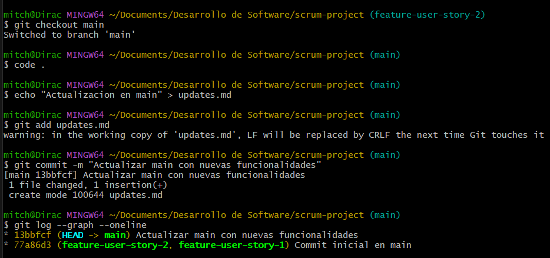

---


```bash
# Rebase de la rama feature-user-story-1 sobre main
$ git checkout feature-user-story-1
$ git rebase main
```

---

**Nos movemos a `feature-user-story-1` y realizamos un `git rebase` con la finalidad de que esta rama cuente con los últimos cambios realizados en main**

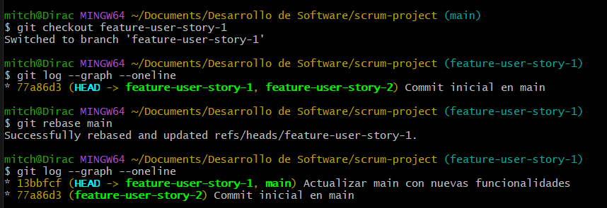

---


**Pregunta:** ¿Qué ventajas proporciona el rebase durante el desarrollo de un sprint en términos de integración continua?

**Respuesta**

> Nos ayuda a mantener las ramas de funcionalidades (`feature branch`) actualizadas con los últimos cambios hechos en la rama principal. Esto es útil en CI ya que los builds y test automáticos deben trabajar sobre un código actualizado.


#### **Fase 3: Revisión del sprint (sprint review)**

**Ejercicio 3: Integración selectiva con git cherry-pick**

En esta fase, es posible que algunas funcionalidades estén listas para ser mostradas a los stakeholders, pero otras aún no están completamente implementadas. Usar `git cherry-pick` puede permitirte seleccionar commits específicos para mostrar las funcionalidades listas, sin hacer merge de ramas incompletas.

**Objetivo:** Mover commits seleccionados de una rama de funcionalidad (`feature-user-story-2`) a `main` sin integrar todos los cambios.

**Instrucciones:**

1. Realiza algunos commits en `feature-user-story-2`.
2. Haz cherry-pick de los commits que estén listos para mostrarse a los stakeholders durante la revisión del sprint.

**Comandos:**
```bash
$ git checkout feature-user-story-2
$ echo "Funcionalidad lista" > feature2.md
$ git add feature2.md
$ git commit -m "Funcionalidad lista para revisión"
```

---

**Ahora trabajaremos en la rama `feature-user-story-2`.  Agregamos un commit el cual esta listo para agregarlo a la rama main ya que se encuentra "listo para revisión"**

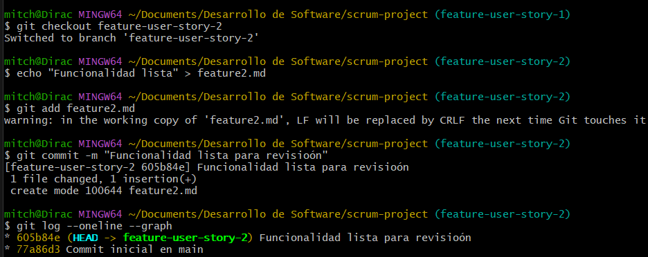

---

```bash
$ echo "Funcionalidad en progreso" > progress.md
$ git add progress.md
$ git commit -m "Funcionalidad aún en progreso"
```

---

**Agregamos un commit adicional en la rama**

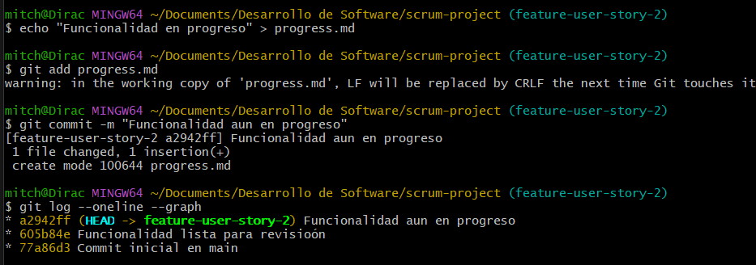

---

```bash
# Ahora selecciona solo el commit que esté listo
$ git checkout main
$ git cherry-pick <hash_del_commit_de_feature-lista>
```

---

**Procedemos a replicar el commit listo para revisión**

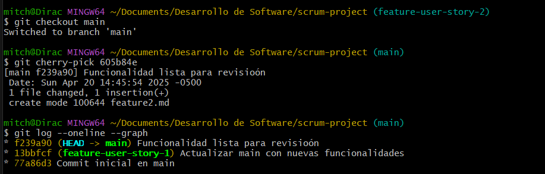

---


**Pregunta:** ¿Cómo ayuda `git cherry-pick` a mostrar avances de forma selectiva en un sprint review?

**Respuesta**

> Como `git cherry-pick` nos ayuda a agregar solo los commits que queremos, esto nos da la opción de mostrar avances específicos sin tener que mostrar el código de toda una rama donde el último commit esta sujeto a errores. 

#### **Fase 4: Retrospectiva del sprint (sprint retrospective)**

**Ejercicio 4: Revisión de conflictos y resolución**

Durante un sprint, pueden surgir conflictos al intentar integrar diferentes ramas de funcionalidades. Es importante aprender cómo resolver estos conflictos y discutirlos en la retrospectiva.

**Objetivo:** Identificar y resolver conflictos de fusión con `git merge` al intentar integrar varias ramas de funcionalidades al final del sprint.

**Instrucciones:**

1. Realiza cambios en `feature-user-story-1` y `feature-user-story-2` que resulten en conflictos.
2. Intenta hacer merge de ambas ramas con main y resuelve los conflictos.

**Comandos:**
```bash
$ git checkout feature-user-story-1
$ echo "Cambio en la misma línea" > conflicted-file.md
$ git add conflicted-file.md
$ git commit -m "Cambio en feature 1"
```

---

**Ahora realizaremos un cambio en la rama `feature-user-story-1`

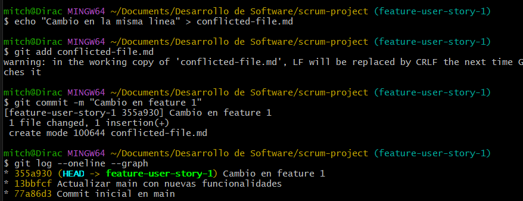

---

```bash
$ git checkout feature-user-story-2
$ echo "Cambio diferente en la misma línea" > conflicted-file.md
$ git add conflicted-file.md
$ git commit -m "Cambio en feature 2"
```

---

**Ahora nos movemos a la rama `feature-user-story-2` y añadimos una nueva modificación para que entre en conflicto con el commit anterior cuando ocurra una fusión**

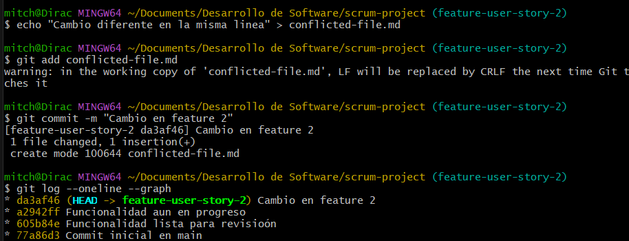

---

```bash
# Intentar hacer merge en main
$ git checkout main
```

---
**Volvemos a la rama `main` y revisamos el historial hasta ese momento. Es un historial general donde podemos todas las ramas**

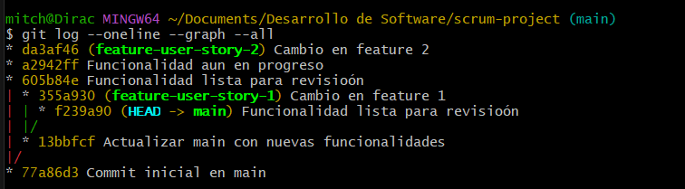

---

```bash
$ git merge feature-user-story-1
```

---

**En este caso no ocurre ningún conflicto porque el archivo `conflicted-file.md` se esta agregando por primera vez en el historial de la rama `main`**


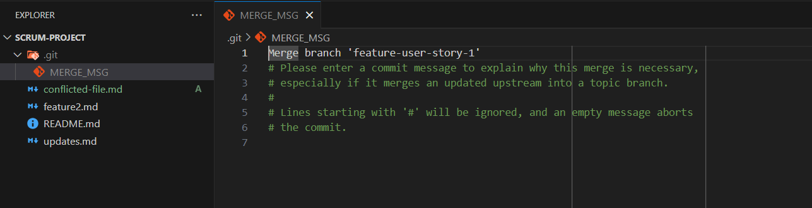
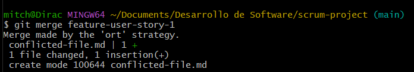

---


```bash
$ git merge feature-user-story-2
```

---

**En efecto, ahora que queremos realizar una nueva fusión ocurre un conflicto porque ahora git no sabe que línea mantener en el archivo `conflicted-file.md`. Si mantiene la línea guardada en `main`, o la hecha en `feature-user-story-2`.

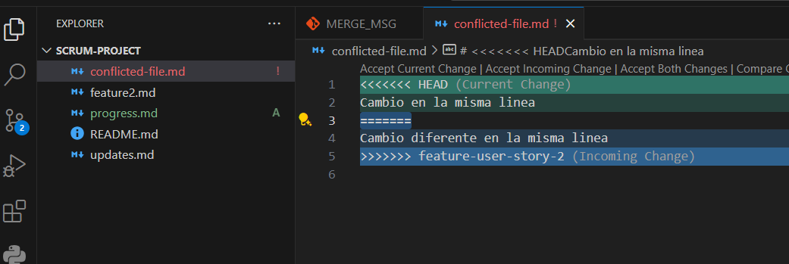
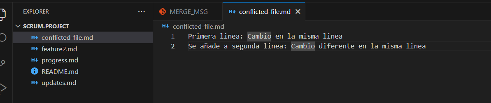
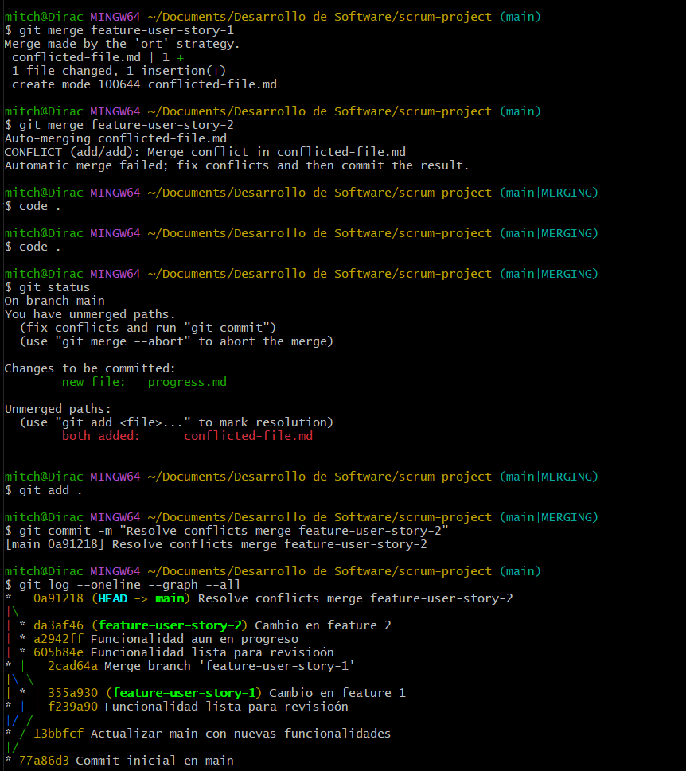

**Una vez resuelto el conflicto realizamos el commit de fusión. Se puede observar como queda el historial**

---

**Pregunta**: ¿Cómo manejas los conflictos de fusión al final de un sprint? ¿Cómo puede el equipo mejorar la comunicación para evitar conflictos grandes?

**Respuesta**

> - Para manejar los conflictos se debe revisar manualmente los archivos que generan estos conflictos de fusión para elegir la versión adecuada, ya sea combinando la información de las ramas, o eligiendo una sobre otra o incluso agregando nuevas líneas.
> - Para evitar conflictos grandes debe haber una comunicación activa en el equipo de desarrollo para que un determinado archivo o grupo de archivo no se modifique por más de una persona o equipos a la vez. Una buena práctica es realizar commits pequeños y frecuentes, como lo recomiendas las lecturas 7 y 8.
> 

---


**A continuación presento un resumen visual desde la Fase 1 hasta la Fase 4**

> 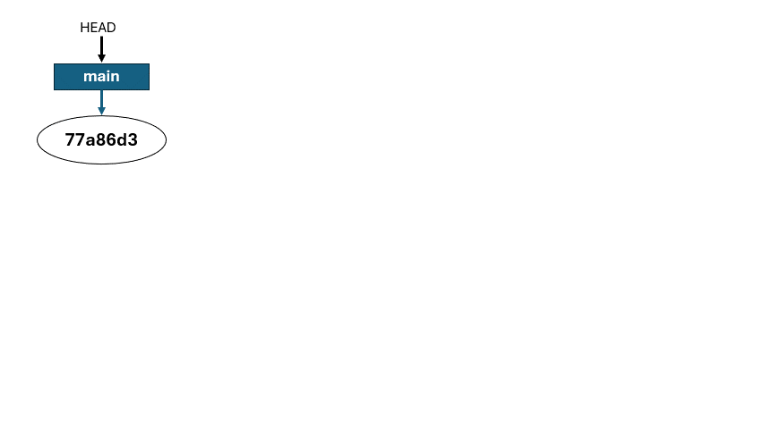


#### **Fase 5: Fase de desarrollo, automatización de integración continua (CI) con git rebase**

**Ejercicio 5: Automatización de rebase con hooks de Git**

En un entorno CI, es común automatizar ciertas operaciones de Git para asegurar que el código se mantenga limpio antes de que pase a la siguiente fase del pipeline. Usa los hooks de Git para automatizar el rebase cada vez que se haga un push a una rama de funcionalidad.

**Objetivo:** Implementar un hook que haga automáticamente un rebase de `main` antes de hacer push en una rama de funcionalidad, asegurando que el historial se mantenga limpio.

**Instrucciones:**

1. Configura un hook `pre-push` que haga un rebase automático de la rama `main` sobre la rama de funcionalidad antes de que el push sea exitoso.
2. Prueba el hook haciendo push de algunos cambios en la rama `feature-user-story-1`.

>Descubrí que los cambios que se hagan en la carpeta hooks no se rastrean por git

---

**Antes de ejecutar los comandos debo crear el repo remoto y configurarlo con un primer push, el no hacerlo me creará errores.**

> 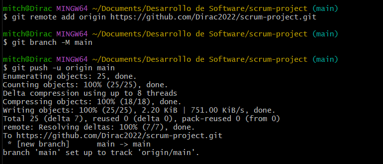

**Adicionalmente insertare un comando adicional que me indique que se esta ejecutando un hook**

---


**Comandos:**
```bash
# Dentro de tu proyecto, crea un hook pre-push
$ nano .git/hooks/pre-push

# Agrega el siguiente script para automatizar el rebase
#!/bin/bash
echo "Ejecutanto hook"
git fetch origin main
git rebase origin/main

# Haz el archivo ejecutable
$ chmod +x .git/hooks/pre-push
```


----
**Presento el contenido de mi  hook `pre-push`

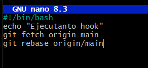


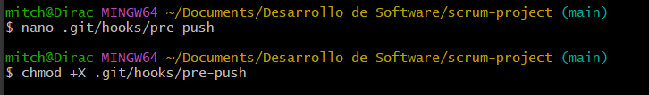

---


```bash
# Simula cambios y haz push
$ git checkout feature-user-story-1
$ echo "Cambios importantes" > feature1.md
$ git add feature1.md
$ git commit -m "Cambios importantes en feature 1"
```

---

**Agrego cambios a la rama  `feature-user-story-1`

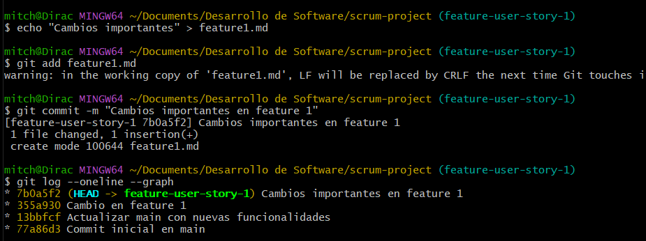

---


```bash
$ git push origin feature-user-story-1
```

---

**Podemos observar que se ejecuta el hook `pre-push`**

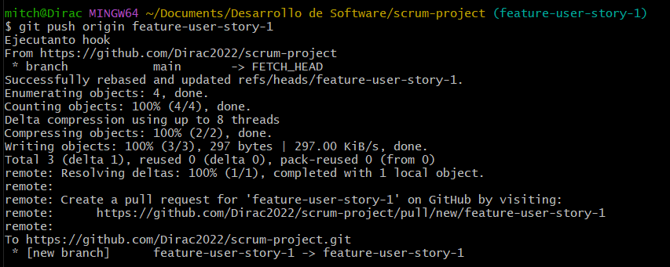

**Al hacer un push se genera un `pull request` en github**

> 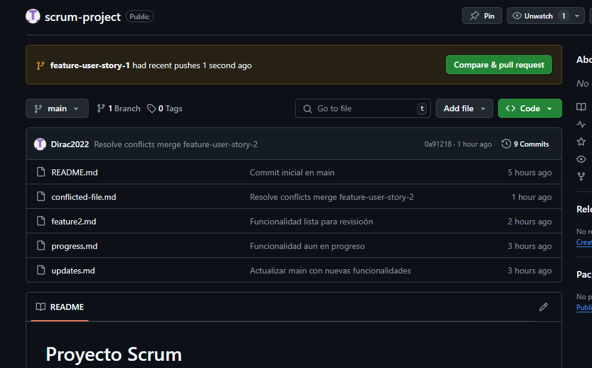

---


**Pregunta**: ¿Qué ventajas y desventajas observas al automatizar el rebase en un entorno de CI/CD?

**Respuesta**

> - Las ventajas inmediatas que observo es un historial de commits lineal, esto nos ayudaría a detectar conflictos, evitando fallos en la integración. 
> - Una desventaja que observo es su complejidad para iniciantes, personalmente me costo un poco entender de manera profunda el concepto detrás del *rebasing* al inicio.
> - Otra desventaja notable es que el historial se reescribe, lo cual puede ser perjudicial en algunos casos.

---

### **Navegando conflictos y versionado en un entorno devOps**

**Objetivo:**  
Gestionar conflictos en Git, realizar fusiones complejas, utilizar herramientas para comparar y resolver conflictos, aplicar buenas prácticas en el manejo del historial de versiones  y usar el versionado semántico en un entorno de integración continua (CI).

**Herramientas:**

- Git  
- Un entorno de desarrollo (Visual Studio Code, terminal, etc.)  
- Un repositorio en GitHub o GitLab (opcional, puede ser local)

**Contexto:**  
En un entorno de desarrollo colaborativo, los conflictos son inevitables cuando varios desarrolladores trabajan en la misma base de código. Resolver estos conflictos es crucial para mantener un flujo de trabajo eficiente en DevOps.

Los conflictos ocurren cuando dos ramas modifican la misma línea de un archivo y luego se intenta fusionarlas. Git no puede decidir qué cambio priorizar, por lo que la resolución manual es necesaria.


#### **Cómo fusionar conflictos en Git:**

1. **Identificar conflictos**: Usa `git status` para ver los archivos en conflicto.
2. **Examinar los archivos**: Busca los marcadores de conflicto (`<<<<<<<`, `=======`, `>>>>>>`) en los archivos.
3. **Resolver los conflictos**: Elige qué cambios conservar (rama actual o fusionada) o mezcla ambos.
4. **Commit de los archivos resueltos**: Después de resolver, añade los archivos al staging y realiza el commit.

#### **Comandos para resolver conflictos**

- `git checkout --ours <file-path>`: Conserva los cambios de tu rama.  
- `git checkout --theirs <file-path>`: Conserva los cambios de la rama fusionada.


#### **Herramientas para gestionar fusiones**

- `git diff`: Compara las diferencias entre dos ramas o commits, ayudando a identificar conflictos:
  ```bash
  $ git diff feature-branch..main
  ```

- `git merge --no-commit --no-ff`: Simula una fusión sin realizar el commit para ver los cambios:
  ```bash
  $ git merge --no-commit --no-ff feature-branch
  $ git diff --cached
  ```
  Si no es lo que esperas, puedes abortar la fusión:
  ```bash
  $ git merge --abort
  ```

- `git mergetool`: Usa herramientas gráficas para resolver conflictos de manera visual. Configura tu herramienta preferida:
  ```bash
  $ git config --global merge.tool vimdiff
  $ git mergetool
  ```

##### **Comandos para organizar tu entorno de trabajo**

- **git reset**: Este comando permite retroceder en el historial de commits. Existen tres tipos:

  1. **Soft Reset**: Mueve el HEAD sin cambiar los archivos:
     ```bash
     $ git reset --soft <commit>
     ```
  2. **Mixed Reset**: Mueve el HEAD y quita archivos del staging, pero mantiene los cambios:
     ```bash
     $ git reset --mixed <commit>
     ```
  3. **Hard Reset**: Elimina todos los cambios no guardados y resetea el directorio de trabajo:
     ```bash
     $ git reset --hard <commit>
     ```

- **git revert**: Deshace cambios sin modificar el historial de commits, creando un nuevo commit:
  ```bash
  $ git revert <commit_hash>
  ```

- **git checkout**: Además de cambiar de ramas, este comando te permite restaurar archivos específicos:
  ```bash
  $ git checkout -- <file_name>
  ```

##### **Herramientas para depurar**

- **git blame**: Muestra qué usuario hizo cambios en una línea específica de un archivo:
  ```bash
  $ git blame file.txt
  ```

- **git bisect**: Realiza una búsqueda binaria para encontrar el commit que introdujo un error:
  ```bash
  $ git bisect start
  $ git bisect bad
  $ git bisect good <commit>
  $ git bisect reset
  ```


##### **git clean y stash**

1. `git clean`: Elimina archivos y directorios no rastreados.
   ```bash
   $ git clean -fd
   ```

2. `git stash`: Guarda cambios sin hacer commit, útil para multitasking.
   ```bash
   $ git stash
   $ git stash apply stash@{0}
   ```

##### **.gitignore**

El archivo `.gitignore` te permite especificar qué archivos y carpetas deben ignorarse durante un `git add`, asegurando que permanezcan exclusivos de tu entorno local.

```bash
# Ignorar todos los archivos de log
.log

# Ignorar archivos de configuración personal
config/personal/
```

##### **Versioning en Git**

Usa versioning semántico para gestionar versiones del software de manera clara:
```bash
$ git tag -a v1.0 -m "Initial stable release"
$ git tag v2.4.4 <commit>
```

---

#### **Ejemplo:**

1. **Inicialización del proyecto y creación de ramas**

   - **Paso 1**: Crea un nuevo proyecto en tu máquina local.
     ```bash
     $ mkdir proyecto-colaborativo
     $ cd proyecto-colaborativo
     ```
   - **Paso 2**: Inicializa Git en tu proyecto.
     ```bash
     $ git init
     ```
   - **Paso 3**: Crea un archivo de texto llamado `archivo_colaborativo.txt` y agrega algún contenido inicial.
     ```bash
     $ echo "Este es el contenido inicial del proyecto" > archivo_colaborativo.txt
     ```
   - **Paso 4**: Agrega el archivo al área de staging y haz el primer commit.
     ```bash
     $ git add .
     $ git commit -m "Commit inicial con contenido base"
     ```

---

**Agregamos el commit inicial de ejercicio. Paso 1 a 4**

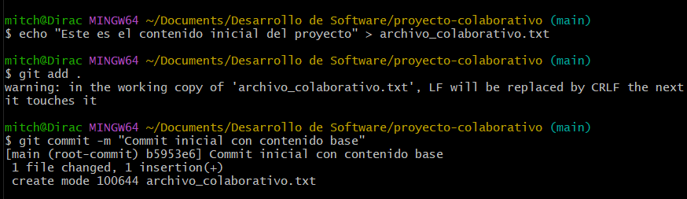   

---

   - **Paso 5**: Crea dos ramas activas: main y feature-branch.
     ```bash
     $ git branch feature-branch  # Crear una nueva rama
     ```
   - **Paso 6**: Haz checkout a la rama feature-branch y realiza un cambio en el archivo `archivo_colaborativo.txt`.
     ```bash
     $ git checkout feature-branch
     $ echo "Este es un cambio en la feature-branch" >> archivo_colaborativo.txt
     $ git add .
     $ git commit -m "Cambios en feature-branch"
     ```

---

**Paso 5 y 6**

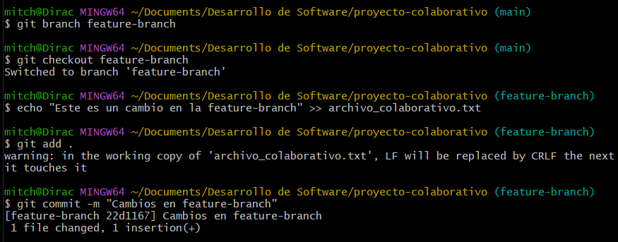

---

   - **Paso 7**: Regresa a la rama main y realiza otro cambio en la misma línea del archivo `archivo_colaborativo.txt`.
     ```bash
     $ git checkout main
     $ echo "Este es un cambio en la rama main" >> archivo_colaborativo.txt
     $ git add .
     $ git commit -m "Cambios en main"
     ```

---

**Paso 7: observamos la bifurcación en el historial de commits**

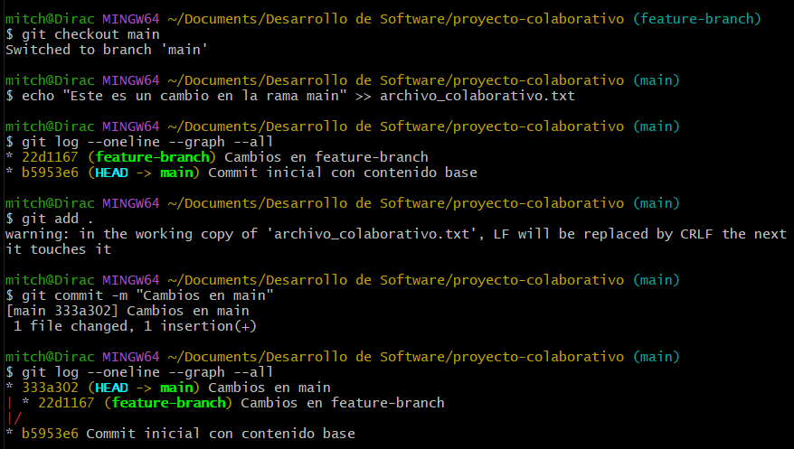

---


2. **Fusión y resolución de conflictos**

   - **Paso 1**: Intenta fusionar feature-branch en main. Se espera que surjan conflictos de fusión.
     ```bash
     $ git merge feature-branch
     ```
   - **Paso 2**: Usa `git status` para identificar los archivos en conflicto. Examina los archivos afectados y resuelve manualmente los conflictos, conservando las líneas de código más relevantes para el proyecto.
     ```bash
     $ git status
     $ git checkout --theirs <archivo>  # Si decides aceptar los cambios de feature-branch
     $ git checkout --ours <archivo>    # Si decides aceptar los cambios de main
     ```
   - **Paso 3**: Una vez resueltos los conflictos, commitea los archivos y termina la fusión
     ```bash
     $ git add .
     $ git commit -m "Conflictos resueltos"
     ```

---

**En mi caso he decidido aceptar los cambios de la rama `main`. Por lo tanto usaré `git checkout --ours archivo_colaborativo.txt`**
 
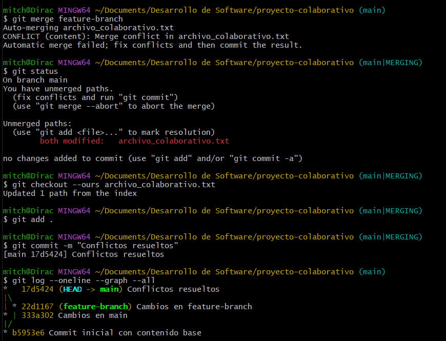

---

3. **Simulación de fusiones y uso de git diff**

   - **Paso 1**: Simula una fusión usando `git merge --no-commit --no-ff` para ver cómo se comportarían los cambios antes de realizar el commit.

---

**Para ello agregaré una tercera línea, tanto en la rama `main` como en `feature-branch`**

> 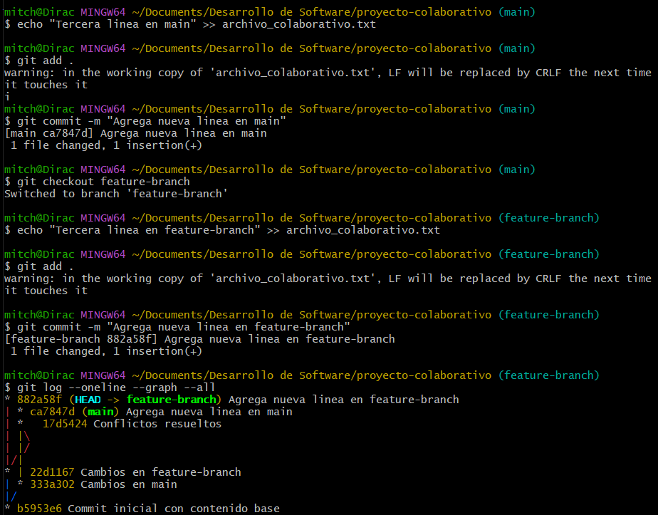


----

```bash
     $ git merge --no-commit --no-ff feature-branch
     $ git diff --cached  # Ver los cambios en el área de staging
     $ git merge --abort  # Abortar la fusión si no es lo que se esperaba
     ```

---

**Intento hacer un merge, sin embargo surgen conflictos por los que uso `git merge --abort`**

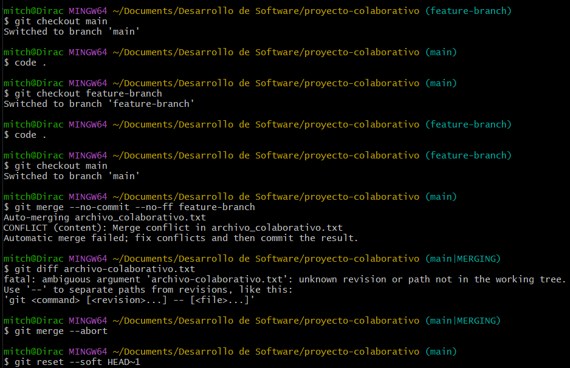

---


4. **Uso de git mergetool**

---

**Así se ve mi historial de commit actualmente:**

> 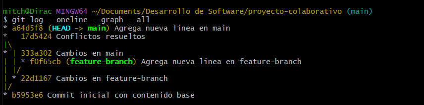


---


   - **Paso 1**: Configura git mergetool con una herramienta de fusión visual (puedes usar meld, vimdiff, o Visual Studio Code).
     ```bash
     $ git config --global merge.tool <nombre-herramienta>
     $ git mergetool
     ```

---

**Realizó la configuración necesaria y uso el comando `git mergetool`**

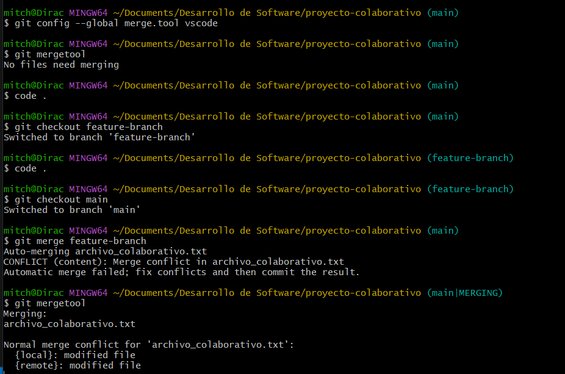

---


   - **Paso 2**: Usa la herramienta gráfica para resolver un conflicto de fusión.

---

**Es una herramienta intuitiva que me ayuda a resolver conflictos manualmente**

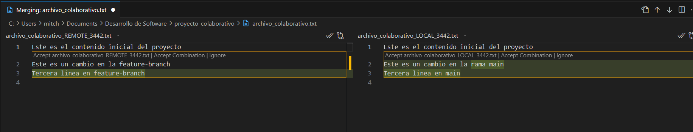

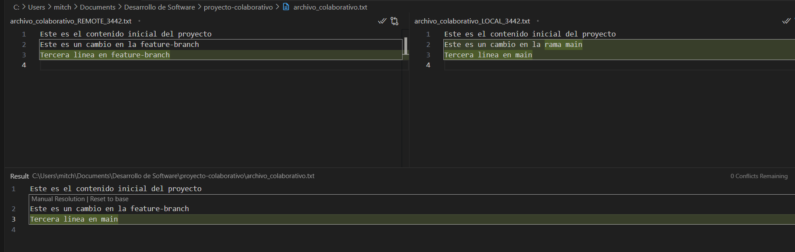

**Una vez resuelto los conflictos realizo el commit de fusión**

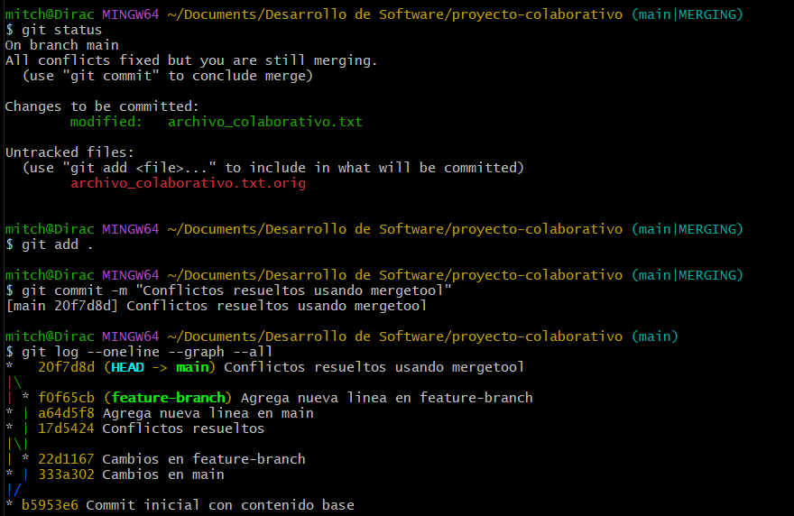

---


5. **Uso de git revert y git reset**


---

**Agrego un nuevo commit en `main`**

> 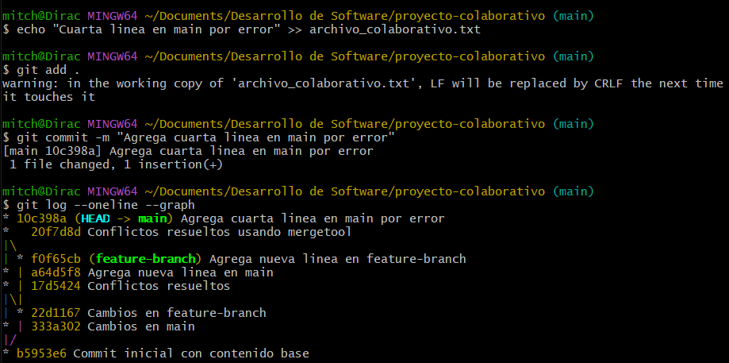

---

   - **Paso 1**: Simula la necesidad de revertir un commit en main debido a un error. Usa `git revert` para crear un commit que deshaga los cambios.

```bash
$ git revert <commit_hash>
```

---

1. **Reviso el archivo**
2. **Hago `git revert`**
3. **Vuelvo a revisar el archivo.**
4. **Veo que la cuarta línea se ha modificado**

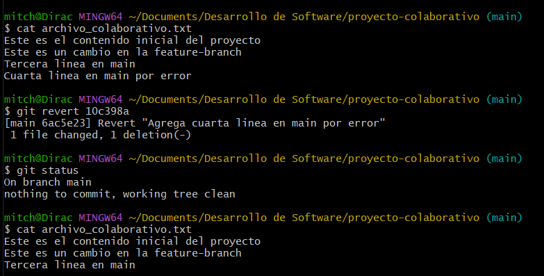

**Compruebo el historial de commits: veo que no se ha eliminado ni reescrito el ultimo commit sino que se ha agregado un nuevo commit que ha "deshecho" el cambio anterior**

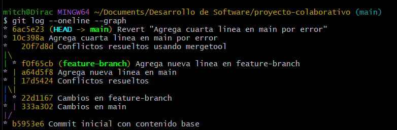

---

   - **Paso 2**: Realiza una prueba con `git reset --mixed` para entender cómo reestructurar el historial de commits sin perder los cambios no commiteados.


---

**Nuevamente agregaré un commit**

> 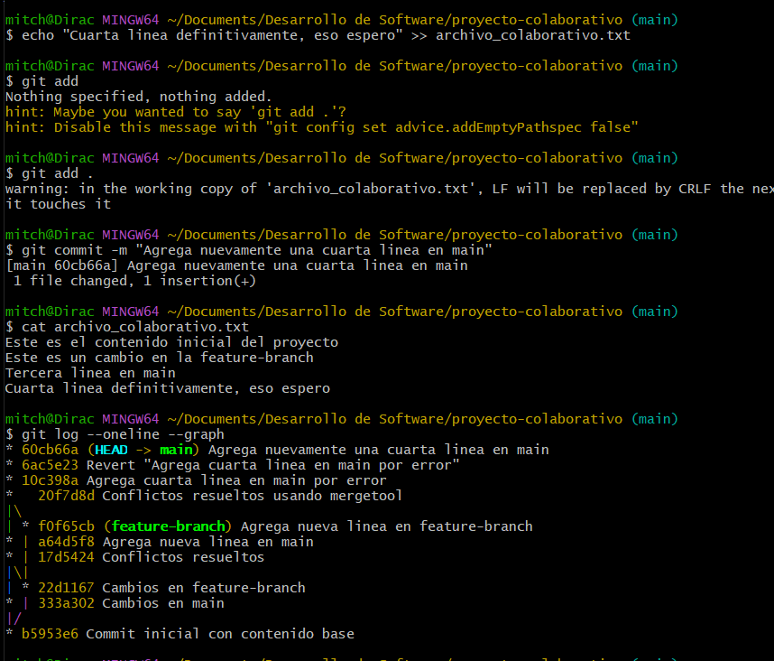

---


```bash
     $ git reset --mixed <commit_hash>
```

---

**Vemos que el HEAD a retrocedido al commit `6ac5e23`, además se han perdido las modificaciones agregadas al staging area, sin embargo, el archivo sigue manteniendo la ultima línea "Cuarta línea definitivamente, eso espero"**

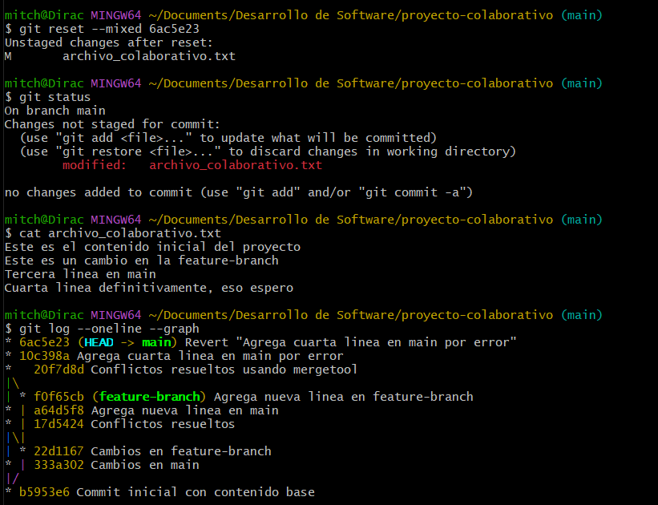

---


6. **Versionado semántico y etiquetado**

   - **Paso 1**: Aplica versionado semántico al proyecto utilizando tags para marcar versiones importantes.
     ```bash
     $ git tag -a v1.0.0 -m "Primera versión estable"
     $ git push origin v1.0.0
     ```


7. **Aplicación de git bisect para depuración**

---

**Estado actual**

> 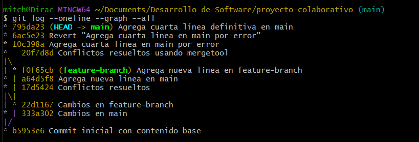

---


   - **Paso 1**: Usa `git bisect` para identificar el commit que introdujo un error en el código.

     ```bash
     $ git bisect start
     $ git bisect bad   # Indica que la versión actual tiene un error
     $ git bisect good <último_commit_bueno>
     # Continúa marcando como "good" o "bad" hasta encontrar el commit que introdujo el error
     $ git bisect reset  # Salir del modo bisect
     ```


---

**Hago uso de git bisect**

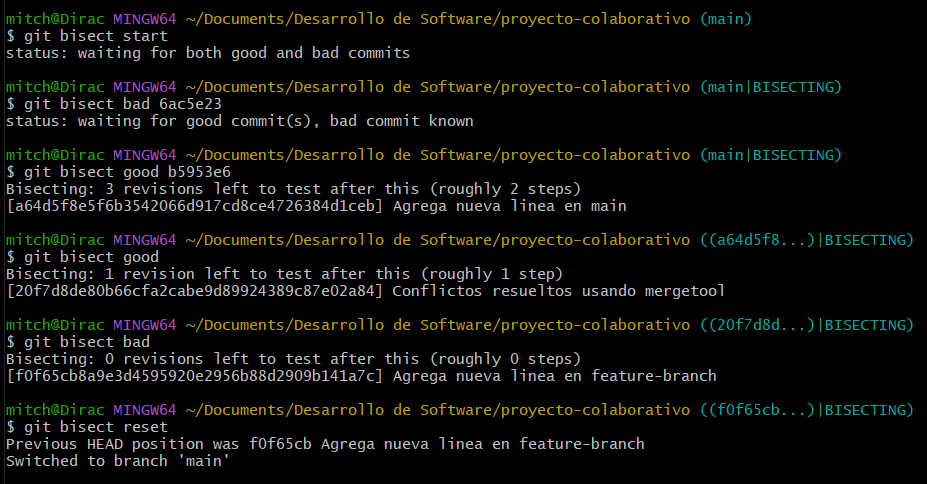

- **Le indico que el commit `6ac5e23` es el malo (el penúltimo commit)**
- **Le indico que el primer commit del proyecto es el bueno**

---


8. **Documentación y reflexión**


   - **Paso 1**: Documenta todos los comandos usados y los resultados obtenidos en cada paso.

---


**Cada comando de git que he ido viendo lo he documentado en un archivo markdown, el cual se encuentra en mi repositorio de apuntes: [Apuntes/Git/Git.md at main · Dirac2022/Apuntes](https://github.com/Dirac2022/Apuntes/blob/main/Git/Git.md)  https://github.com/Dirac2022/Apuntes/blob/main/Git/Git.md**


> 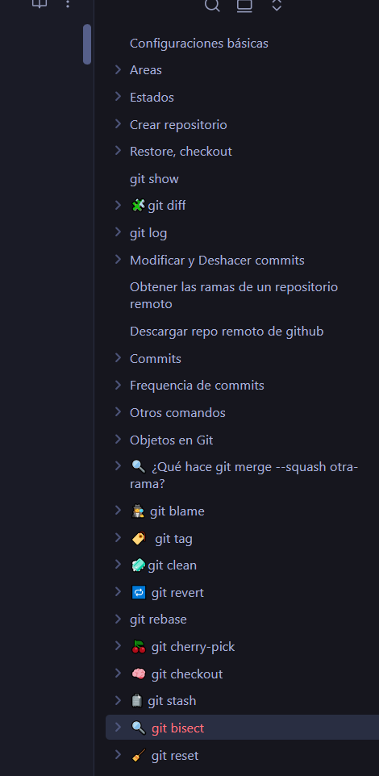

---


   - **Paso 2**: Reflexiona sobre la utilidad de cada comando en un flujo de trabajo de DevOps.
   
> Cada comando de git tiene una utilidad específica, los comandos que encuentro más importantes en DevOps son los relacionados a integración, por ejemplo
> - `git merge` ,  `git rebase`, y `git cherry-pick`
> - `git log` para revisar el historial de commit, algo que personalmente uso muchísimo dado que soy nuevo en git.
> - `git reset` y `git revert` para salvar errores
> - `git diff` para analizar las diferencias entre archivos, commit o ramas.
> - `git stash` para mantener a salvo el trabajo realizado, mientras se trabaja en otra tarea.

#### **Preguntas**

1. **Ejercicio para git checkout --ours y git checkout --theirs**

   **Contexto**: En un sprint ágil, dos equipos están trabajando en diferentes ramas. Se produce un conflicto de fusión en un archivo de configuración crucial. El equipo A quiere mantener sus cambios mientras el equipo B solo quiere conservar los suyos. El proceso de entrega continua está detenido debido a este conflicto.

   **Pregunta**:  
   ¿Cómo utilizarías los comandos `git checkout --ours` y `git checkout --theirs` para resolver este conflicto de manera rápida y eficiente? Explica cuándo preferirías usar cada uno de estos comandos y cómo impacta en la pipeline de CI/CD. ¿Cómo te asegurarías de que la resolución elegida no comprometa la calidad del código?

2. **Ejercicio para git diff**

   **Contexto**: Durante una revisión de código en un entorno ágil, se observa que un pull request tiene una gran cantidad de cambios, muchos de los cuales no están relacionados con la funcionalidad principal. Estos cambios podrían generar conflictos con otras ramas en la pipeline de CI/CD.

   **Pregunta**:  
   Utilizando el comando `git diff`, ¿cómo compararías los cambios entre ramas para identificar diferencias específicas en archivos críticos? Explica cómo podrías utilizar `git diff feature-branch..main` para detectar posibles conflictos antes de realizar una fusión y cómo esto contribuye a mantener la estabilidad en un entorno ágil con CI/CD.

3. **Ejercicio para git merge --no-commit --no-ff**

   **Contexto**: En un proyecto ágil con CI/CD, tu equipo quiere simular una fusión entre una rama de desarrollo y la rama principal para ver cómo se comporta el código sin comprometerlo inmediatamente en el repositorio. Esto es útil para identificar posibles problemas antes de completar la fusión.

   **Pregunta**:  
   Describe cómo usarías el comando `git merge --no-commit --no-ff` para simular una fusión en tu rama local. ¿Qué ventajas tiene esta práctica en un flujo de trabajo ágil con CI/CD, y cómo ayuda a minimizar errores antes de hacer commits definitivos? ¿Cómo automatizarías este paso dentro de una pipeline CI/CD?

4. **Ejercicio para git mergetool**

   **Contexto**: Tu equipo de desarrollo utiliza herramientas gráficas para resolver conflictos de manera colaborativa. Algunos desarrolladores prefieren herramientas como vimdiff o Visual Studio Code. En medio de un sprint, varios archivos están en conflicto y los desarrolladores prefieren trabajar en un entorno visual para resolverlos.

   **Pregunta**:  
   Explica cómo configurarías y utilizarías `git mergetool` en tu equipo para integrar herramientas gráficas que faciliten la resolución de conflictos. ¿Qué impacto tiene el uso de `git mergetool` en un entorno de trabajo ágil con CI/CD, y cómo aseguras que todos los miembros del equipo mantengan consistencia en las resoluciones?

5. **Ejercicio para git reset**

   **Contexto**: En un proyecto ágil, un desarrollador ha hecho un commit que rompe la pipeline de CI/CD. Se debe revertir el commit, pero se necesita hacerlo de manera que se mantenga el código en el directorio de trabajo sin deshacer los cambios.

   **Pregunta**:  
   Explica las diferencias entre `git reset --soft`, `git reset --mixed` y `git reset --hard`. ¿En qué escenarios dentro de un flujo de trabajo ágil con CI/CD utilizarías cada uno? Describe un caso en el que usarías `git reset --mixed` para corregir un commit sin perder los cambios no commiteados y cómo afecta esto a la pipeline.

6. **Ejercicio para git revert**

   **Contexto**: En un entorno de CI/CD, tu equipo ha desplegado una característica a producción, pero se ha detectado un bug crítico. La rama principal debe revertirse para restaurar la estabilidad, pero no puedes modificar el historial de commits debido a las políticas del equipo.

   **Pregunta**:  
   Explica cómo utilizarías `git revert` para deshacer los cambios sin modificar el historial de commits. ¿Cómo te aseguras de que esta acción no afecte la pipeline de CI/CD y permita una rápida recuperación del sistema? Proporciona un ejemplo detallado de cómo revertirías varios commits consecutivos.

7. **Ejercicio para git stash**

   **Contexto**: En un entorno ágil, tu equipo está trabajando en una corrección de errores urgente mientras tienes cambios no guardados en tu directorio de trabajo que aún no están listos para ser committeados. Sin embargo, necesitas cambiar rápidamente a una rama de hotfix para trabajar en la corrección.

   **Pregunta**:  
   Explica cómo utilizarías `git stash` para guardar temporalmente tus cambios y volver a ellos después de haber terminado el hotfix. ¿Qué impacto tiene el uso de `git stash` en un flujo de trabajo ágil con CI/CD cuando trabajas en múltiples tareas? ¿Cómo podrías automatizar el proceso de *stashing* dentro de una pipeline CI/CD?

8. **Ejercicio para .gitignore**

   **Contexto**: Tu equipo de desarrollo ágil está trabajando en varios entornos locales con configuraciones diferentes (archivos de logs, configuraciones personales). Estos archivos no deberían ser parte del control de versiones para evitar confusiones en la pipeline de CI/CD.

   **Pregunta**:  
   Diseña un archivo `.gitignore` que excluya archivos innecesarios en un entorno ágil de desarrollo. Explica por qué es importante mantener este archivo actualizado en un equipo colaborativo que utiliza CI/CD y cómo afecta la calidad y limpieza del código compartido en el repositorio.

---

#### **Ejercicios adicionales**

##### **Ejercicio 1: Resolución de conflictos en un entorno ágil**

**Contexto:**  
Estás trabajando en un proyecto ágil donde múltiples desarrolladores están enviando cambios a la rama principal cada día. Durante una integración continua, se detectan conflictos de fusión entre las ramas de dos equipos que están trabajando en dos funcionalidades críticas. Ambos equipos han modificado el mismo archivo de configuración del proyecto.

**Pregunta:**  
- ¿Cómo gestionarías la resolución de este conflicto de manera eficiente utilizando Git y manteniendo la entrega continua sin interrupciones? ¿Qué pasos seguirías para minimizar el impacto en la CI/CD y asegurar que el código final sea estable?

**Respuesta**

> - Coordinaría con los dos equipos involucrados para decidir que cambios se agregarían a la rama principal.
> - Una vez decidido que cambios se agregarían, me aseguraría que que pasen todas las pruebas automatizadas para que minimicen el impacto en la CI/CD.


##### **Ejercicio 2: Rebase vs. Merge en integraciones ágiles**

**Contexto:**  
En tu equipo de desarrollo ágil, cada sprint incluye la integración de varias ramas de características. Algunos miembros del equipo prefieren realizar merge para mantener el historial completo de commits, mientras que otros prefieren rebase para mantener un historial lineal.

**Pregunta:**  
- ¿Qué ventajas y desventajas presenta cada enfoque (merge vs. rebase) en el contexto de la metodología ágil? ¿Cómo impacta esto en la revisión de código, CI/CD, y en la identificación rápida de errores?

**Respuesta**

> - La ventaja de merge, es que mantiene el historial de commits, la desventaja es que puede volver el historial complejo, con muchas bifurcaciones y ramas paralelas.
> Rebase por otro lado, mantiene una historial lineal, lo cual es ventajoso en muchos aspectos, como la revisión de código o restaurar el proyecto a un estado estable.
> - Un historial lineal impacta positivamente en la revisión de código, ya que es mas sencillo de analizar y conduce a la rápida identificación de errores.


##### **Ejercicio 3: Git Hooks en un flujo de trabajo CI/CD ágil**

**Contexto:**  
Tu equipo está utilizando Git y una pipeline de CI/CD que incluye tests unitarios, integración continua y despliegues automatizados. Sin embargo, algunos desarrolladores accidentalmente comiten código que no pasa los tests locales o no sigue las convenciones de estilo definidas por el equipo.

**Pregunta:**  
- Diseña un conjunto de Git Hooks que ayudaría a mitigar estos problemas, integrando validaciones de estilo y tests automáticos antes de permitir los commits. Explica qué tipo de validaciones implementarías y cómo se relaciona esto con la calidad del código y la entrega continua en un entorno ágil.


##### **Ejercicio 4: Estrategias de branching en metodologías ágiles**

**Contexto:**  
Tu equipo de desarrollo sigue una metodología ágil y está utilizando Git Flow para gestionar el ciclo de vida de las ramas. Sin embargo, a medida que el equipo ha crecido, la gestión de las ramas se ha vuelto más compleja, lo que ha provocado retrasos en la integración y conflictos de fusión frecuentes.

**Pregunta:**  
- Explica cómo adaptarías o modificarías la estrategia de branching para optimizar el flujo de trabajo del equipo en un entorno ágil y con integración continua. Considera cómo podrías integrar feature branches, release branches y hotfix branches de manera que apoyen la entrega continua y minimicen conflictos.

**Respuesta**


> - Usaría los patrones base: source branching, mainline y healthy branch como pilares de mi estrategia, ya que estas favorecen el enfoque CI/CD.
> - Si el proyecto es complejo usaría el enfoque de GitFlow donde la rama de trabajo será `develop` y por cada característica crearía a partir de `develop` una `feature-branch`. Para las integraciones usaría `git rebase` ya que es conveniente llevar un historial claro y lineal.
> - Si el proyecto es pequeño y la autoría es importante, `git merge` sería la mejor opción, ya que el historial se puede volver medianamente complejo, pero al ser un proyecto pequeño sería manejable, además al no reescribirse el historial, cada commit, cada trabajo realizado por cada colaborador se mantendría en el historial.
> - Gestionaría reuniones relámpago (5 min max) para evaluar los conflictos surgidos en las fusiones y decidir que cambios se van a agregar.
> 

##### **Ejercicio 5: Automatización de reversiones con git en CI/CD**


**Contexto:**  
Durante una integración continua en tu pipeline de CI/CD, se detecta un bug crítico después de haber fusionado varios commits a la rama principal. El equipo necesita revertir los cambios rápidamente para mantener la estabilidad del sistema.


**Pregunta:**  
- ¿Cómo diseñarías un proceso automatizado con Git y CI/CD que permita revertir cambios de manera eficiente y segura? Describe cómo podrías integrar comandos como `git revert` o `git reset` en la pipeline y cuáles serían los pasos para garantizar que los bugs se reviertan sin afectar el desarrollo en curso.

**Respuesta**

> Diseñaría un proceso que use `git revert`, elegiría este comando en vez de `git reset` ya que no es tan destructivo para el historial. Esta lógica se integraría en el pipeline usando por ejemplo  GitHub Actions, es decir un proceso que se active automáticamente cuando fallen ciertas pruebas tras un push a la rama main. 


--- 
**Entrega:**  
- Al finalizar, debes hacer push a su repositorio remoto con los cambios realizados y etiquetar el commit final.

**Evaluación:**  
- El dominio de los comandos Git será evaluado, junto con la correcta resolución de conflictos, uso de herramientas de fusión, y comprensión de versionado semántico.